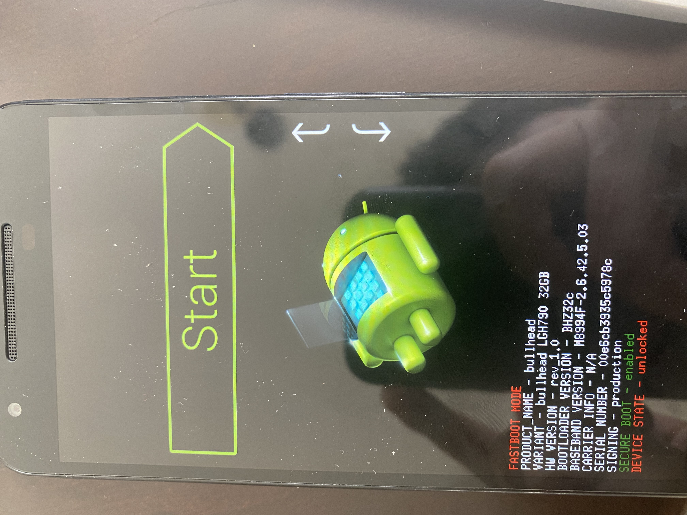
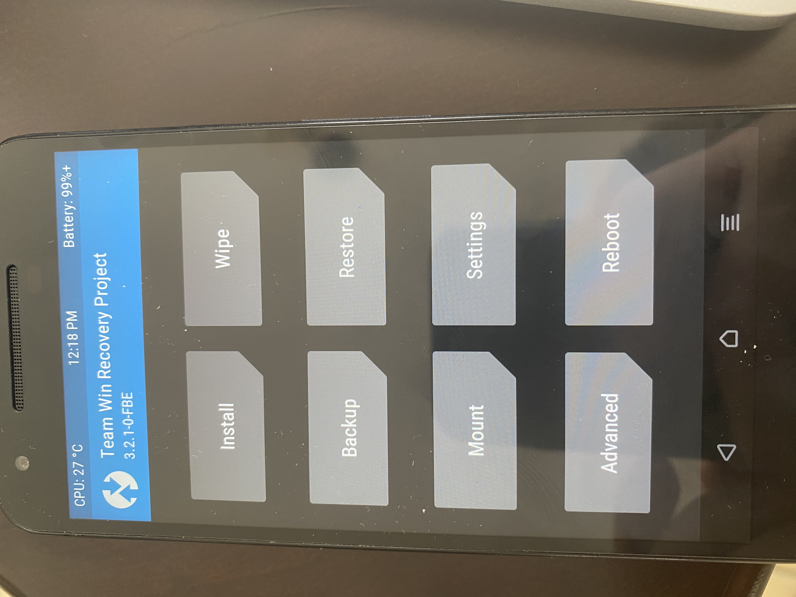

A few years ago, when I had my first or second android phone(it was a galaxy s3 mini), I started to get interest in android development. By android development I'm referring the tools that devs create in order to alter or modify the behavior of android phones. I did not and I don't take part of the development of the tools(a big kudos for those guys, they work really hard to help the community even if that means using their free time), thus that would be awesome currently I have other priorities. In this posts I'll share some concepts you should know in order to understand waht does android development means

### Rooting:

Is the proccess to allow you to get super user access in your android phone. Normally uses exploits or vulnerabilities found in the phone source code to obtain the root or super user access. With rooting your phone gains superpowers because you can mod it like hell but you should be careful because you could also brick your device if you don't know what you're doing.

### USB Debugging:

This is a functionality that allows computers that have the android developer tools installed, to be able to recognize your device when you connect it via usb. It is not the same as reading files or copying files like you are used to.

### ADB:

Android debug bridge is a script that allows you to communicate with your phone. It is used by android developers because you can sideload apps via adb(more on that later) that will allow to test applications in development in the phone.

### Android OS:

Operating system that powers most of the devices in the world, it is based on the linux kernel. The source code is called AOSP(Android Open Source Project) and it is licensed by the apache license, that means anyone is allowed to modify it.

### Bootloader:

Is a software image that is propietary of the vendor, it checks that the phone is working properly and is the ones who starts the android system.
Bootloaders can flash system images that contains the android OS to your phone.
Most bootloaders come locked from the factory. A locked bootloader means that you can only install vendor approved android images, not custom ones, that is why people usually unlock their bootloaders, to be able to install non official android images, for example custom recoveries. **Most of the android manufacturers void your warranty if you unlock the bootloader**

_A picture of my unlocked bootlaoder in my old nexus 5x_

### Recovery:

Recovery is another system image, as it name suggests is used to try to recover your system if something fails, for example reinstall the system or delete apps / data from your phone. The stock recovery normally is just for recovery as the name suggests, so android developers create their own recoveries to bring more functionality to the phone, for example the abbility to flash custom android versions, or modifying the internal system parts like having a custom kernel.

_A picture of my custom twrp recovery in my old nexus 5x_

### Bootloop:

A term that is used when your phone is unable to boot and is stuck on the init animation of the phone. Usually happens when you are messing with the phone and installing custom stuff, but it can happen to non modded phones as well though is not usual.

### ROM

A ROM is a custom version of the AOSP, there are stock roms which means that are the ones offered by the vendor, for example Huawei offers its own custom ROM called **EMUI**. Also we have custom roms that are created by the community for free just for the sake of modding **LineageOS** is a custom ROM that is pretty popular in the android community. ROMS are specific for devices, so there are devices that have more roms than others. The main reason for this is that there are certain OEMS that makes unlocking the bootloader a pain in the ass. Some users like to use a custom ROM because they like having privacy, usually ROMS are free of google apps, so there're some hardcore users there that don't have google in their phone and a custom ROM allows you to do it.

### GAPPS

Acronym for **google apps**, a zip offered to install all the neccesary apps to use google services in a custom ROM, because roms normally just contain the neccesary apps to make your phone usable, they're offered in variants (for example a minimal setup or a full app installation) and they vary according to the version of android and its platform

## State of rooting now

This is a personal opinion, nowadays I don't use android as a daily phone(I would not believe that 5 years ago) but even though I would say it was pretty fun messing with your phone and install custom roms back in the day.

Android development is still active thus I believe is not as active as it used to be and I get it, nowadays android phones come pretty cool out of the box and one of the main reasons people used to mod their phones was because carriers and OEMS did not offer things that user wanted to have. Modding was the response from the dev community to get the device full potential, so I guess this is one of the reasons the community is not as active as it used to be.

For example my last android phone was the pixel 2, I did not even bother to unlock the bootloader, because the stock phone was pretty good. I'll be honest though, in my opinion pixel phones are the exception, I do think if I have a Samsung, or a Huawei I would have root them, just because the UI of those phones sucks. Pixel on the other hand, like OnePlus try to keep android stock as possible, without an UI full of bloatware.

I also think custom android development has been pretty beneficial to android itself, without it there could be functions that we won't have today, for example dark theme, having custom profiles, camera features, shortcuts, touching the screen twice to block your phone, etc.

I don't think this community will die because it was created to fight against the OEMS and carriers, so as long as them continue doing things that affect the consumer, there will be heroes that are going to help fighting against the system.
