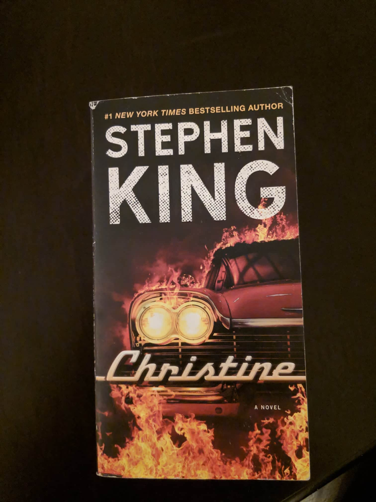

## "El oscuro protagonista de esta novela es un automovil marca Plymouth de 1958 llamado Christine, un superviviente de un tiempo en que la gasolina era barata y el rock and roll marcaba el ritmo de la época"

Normalmente no leo libros, pero este en específico fue un placer leerlo, Vi la película el año pasado y fue tan buena que decidí comprar el libro.
Sentí que la película no me dijo muchas cosas que quería saber(es una película por supuesto), así que compré la versión en español del libro y termine comprando la versión en inglés, que también leí.

Lo de leer no es lo mío y no me considero un ávido lector, pero creo que leer es un hábito muy importante, y me encantaría tenerlo pero ... Creo que tengo otras prioridades y pasatiempos que prefiero ( lo siento, me gusta llamar la atención y necesitaba hablar de mí). De todos modos aquí va.

En un breve resumen, Christine es un drama de terror para adolescentes, que involucra a **Arnie** el protagonista (algo así) y a su mejor amigo **Dennis** el antagonista (es una cuestión de perspectivas, pero creo que Dennis fue el antagonista aquí ); una chica llamada **Leigh**, y por supuesto no podemos olvidarnos de la propia estrella, que es **Christine** un plymouth fury de 1958 poseído por su primer dueño(Roland "Rollie" Lebay).

Como podrías estar pensando, eso suena como un libro muy estúpido, lo cual es entendible(cómo una máquina encantada puede dar miedo) pero no estoy de acuerdo, porque parte de la belleza del libro es la evolución de los personajes principales y la simplicidad de su trama.

Arnie es un nerd, descrito como un chico feo lleno de granos(nada nuevo para el estereotipo nerd y como dato curioso las espinillas no están presentes en la película). Él compra a Christine, es un amor a primera vista y en el momento en que comienza a repararla.(porque ella está en muy malas condiciones), él comienza a cambiar, se puede ver cómo Arnie comienza a actuar más arrogante y rudo, mientras que las espinillas en su cara comienzan a desaparecer (muy cliché lo sé).

Dennis, a diferencia de Arnie, es un tipo cool desde el principio (guapo, futbolista, popular), pero comienza a tener una racha de mala suerte, se lastima jugando al fútbol y una gran parte de la historia está hospitalizado; También ve cómo Arnie comienza a salir con la nueva chica de la escuela, **Leigh Cabot** y no puede creerlo.

Arnie y Dennis son mejores amigos, que es una de las estupideces que tiene el libro, por supuesto, un nerd y un deportista **no pueden ser amigos**, pero de todos modos la relación comienza a desvanecerse en el momento en que Arnie comienza a reparar a Christine.

A medida que el libro continúa, te das cuenta de que Christine se está convirtiendo en lo más querido de Arnie y que todo lo que solía amar se vuelve menos importante que Christine (sus padres, Leigh, Dennis).

Esa obsesión con el coche encantado se convirtió en su tumba, pasan muchas cosas, Christine esta matando todo lo que este delante de ella y Arnie, también Dennis traiciona a Arnie de una manera bastante cobarde, aunque Arnie ya no es él mismo (¿tiene eso sentido? ?). Aunque no parezca uno empieza a tener miedo de todas las personas que aman a sus autos más que a sí mismos.

La belleza del libro radica en la habilidad para hacer un drama adolescente regular y poder mezclarlo con el horror, lo cual hace que estes entretenido y continues leyendo. El libro en sí mismo nos hace sentirnos identificados con lo difícil que es ser un adolescente, estar solo, por nuestra cuenta, experimentando muchas cosas nuevas, tratando de tener éxito en la escuela ademas de tener éxito relaciones con los demas y al mismo tiempo hay que lidiar con bullying y la pubertad. Ademas tiene la chispa adicional que permite darle vida a un carro y que este ahuyente a los personajes e ¿incluso a ustedes?

¿Debería leerlo? Supongo que primero tiene que ver la película y si la logra disfrutar, creo que se puede dar una oportunidad al libro.
