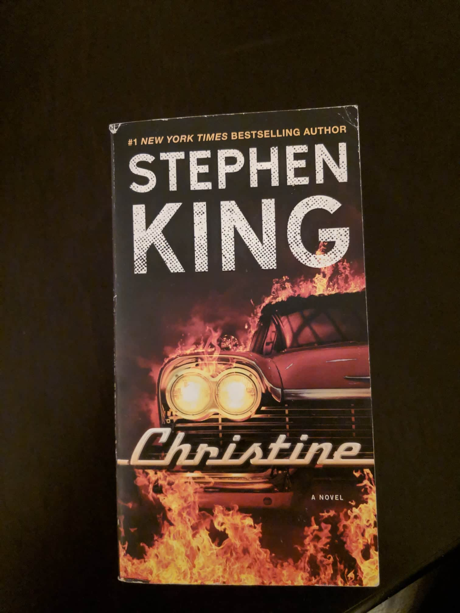

# "This is the story of a lover's triangle... It was bad from the start and it got worse in a hurry."

I normally don't read books, but this one was a pleasure to read, I saw the movie last year and it was so good that I decided to purchase the book. I felt that the movie did not tell me a lot of things I wanted to(it's a movie of course), so I bought the spanish version of the book and I ended buying the english version as well which I also read.

Reading is not my thing and I don't consider myself as an avid reader, but I do think reading is a very important habit, and I would love to have it but... I think I have other priorities and hobbies I prefer(sorry I'm an attention seeker and I needed to talk about me). Anyways here it goes.

Christine in a short summary, is teenage horror drama, that involves **Arnie** the protagonist(kind of) and his best friend **Dennis** the antagonist(it is a matter of perspectives but I think Dennis was the antagonist here), a girl named **Leigh**, and of course we can't forget the star itself, which is **Christine** a 1958 plymouth fury possesed by her first owner(Roland "Rollie" Lebay).

As you could be thinking that sounds like an stupid book, which I understand(how a haunted machine can be scary) but I disagree of course, because part of the beauty of the book is the evolution of the main characters and its plot simplicity.

Arnie is a nerd, is described as an ugly guy full of pimples(nothing new for the nerd stereotype and the pimples are not present in the movie). He purchases Christine, a first love purchase, and at the moment he starts repairing her(because she's in a pretty bad condition), he starts to change, you can see how Arnie's starts to act more cocky and badass, while the pimples on his face began to disappear(so cliche I know).

Dennis unlike Arnie, is a pretty cool guy from the beginning, (handsome, football player, popular) but he begins to have a run of bad luck, he gets hurt while playing football and a large part of the story is hospitalized; He also sees how Arnie starts dating the new girl of the school, **Leigh Cabot** and he can't believe it.

Arnie and Dennis are best friends, which is one of the nonsense things that the book has, of course a nerd and a jock can't be friends, but anyways the relationship starts to fade away the moment Arnie begans to repair Christine.

As the book continues you notice that Christine is becoming Arnie's most beloved thing and everything else he used to love becomes less important than Christine(his parents, Leigh, Dennis).

That obsession with the haunted car became his grave, there's a lot happening, Christine killing everything that stands in front of her and Arnie, also Dennis betrays Arnie in a pretty bad way, even though Arnie is not himself anymore(does that even make sense?). Believe it or not you're going to be afraid of all the guys who love their cars more than themselves.

The beauty of the book lies in the abillity to make a regular teenage drama and being able to mix it with horror, that makes you stay entertained and continue reading. The book itself make you feel related on how difficult is to be a teenager, you're alone, just by yourself experimenting a lot of new things, trying to succeed in school as well in your social duties, while dealing with bullying and puberty. And it has the added spark which allows a car to be alive and scare the shit out of the characters and even yourself?

Should you read it? I guess you should watch the movie first and if you enjoy it, I think you should give the book a chance.
