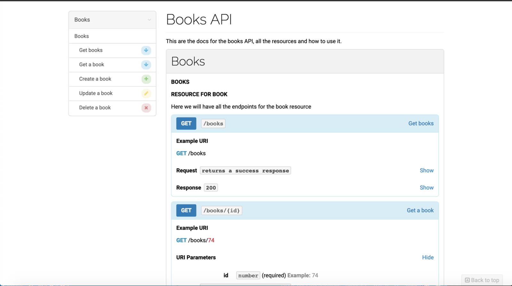

Hola en este post me gustaria hablar de una gema que se llama [dox](https://github.com/infinum/dox), en la universidad estoy creando un backend en rails que va ser consumido por una aplicación de android, uno de los requerimientos que se pidieron para el proyecto fue documentar el API, todos sus endpoints y cosas que el API envía y recibe para funcionar.

Nunca en mi vida había hecho algo similar pero la primera cosa que se me vino a la mente fue que rails seguramente tenía alguna gema para generar documentación sobre los resources generados. Despues de algunas horas de busqueda, descubrí otras gemas que hacían lo mismo pero su forma de implementar no cumplía con los requerimientos o el uso que yo queria darles. Por ejemplo referenciarlas en el controlador o crear nuevos tests solo para la gema.

Dox fue la escogida sobre las otras, porque genera la documentación basandose en los tests de los controladores generados con RSpec; Aún así se necesitan crear nuevos archivos en la carpeta spec, para dar formato a la documentación, se integra facilmente a los tests existentes. No es nada mágico, se ocupa configurar e integra con RSpec y la documentación no es muy grande, solo lo básico para setearla, entonces en este post les voy a enseñar como integrarla a un API en rails.

Primero que nada tenemos que inicializar el proyecto:

```bash
$ rails new book-app --api -T --database=postgresql
```

Despues ocupamos integrar RSpec y dox en nuestro Gemfile:

```ruby
group :development, :test do
# Rest of the gems on this block.....
  gem 'rspec-rails', '~> 3.8'
end
group :test do
  gem "dox", require: false
end
```

Luego correr los siguientes comandos para instalar las dependencias:

```bash
$ bundle install
```

```bash
$ rails generate rspec:install
```

Sí estas leyendo esto, debes estar familiarizado con integrar RSpec con rails, ya que no voy a estar mostrando como hacerlo, solo los pasos necesarios para integrar Dox en la aplicación.

Necesitamos configurar dox en el rails_helper para integrarlo con RSpec.

```ruby
# spec/rails_helper.rb
require "dox" # This should go below the RSpec require

# This is telling RSpec to use all of the files in that folder you can name it as you want, in this case it will be "docs"

Dir[Rails.root.join("spec/docs/**/*.rb")].each { |f| require f }
RSpec.configure do |config|
  config.after(:each, :dox) do |example|
    example.metadata[:request] = request
    example.metadata[:response] = response
  end
end
# This last config is to specify which files are the ones which are going to be in charge to be associated with the created resource
Dox.configure do |config|
  config.header_file_path = Rails.root.join("spec/docs/descriptions/header.md")
  config.desc_folder_path = Rails.root.join("spec/docs/descriptions")
  config.headers_whitelist = ["Accept"]
end
```

Eso es basicamente todo lo necesario para configurarlo, entonces generemos un scaffold y corramos la migración del mismo para documentarlo:

```bash
$ rails g scaffold Book title plot:text
```

```bash
$ rails db:migrate
```

Sí todo funciono, se tuvieron que generar los tests con RSpec, en este caso vamos a utilizar el controlador generado con el scaffold, sin modificar nada por motivos de enseñanza. La clave para utilizar Dox es que necesitas especificar cual endpoint se quiere documentar usando el spec del controlador que como hicimos un sacaffold fue generado automaticamente.

Ahora necesitamos crear un folder nuevo llamado docs, este va contener otro folder adentro llamado descriptions, que a su vez va tener archivos con extension .md files que son los encargados de mostrar información estática dentro de la documentación, descripciones o pasos que el usuario desee indicar.

Vamos a crear nuestro archivo book.md que va ser asociado al scaffold que acabamos de generar, asimismo ocupamos otro archivo header.md que es el que va tener nuestro título y descripción del API.

```md
# spec/docs/descriptions/books.md

### Resource for Book

Here we will have all the endpoints for the book resource

# spec/docs/descriptions/header.md

# Books API

This are the docs for the books API, all the resources and how to use it.
```

Ahora que tenemos una descripción para nuestro resource de Books, necesitamos crear en la carpeta docs aun archivo que va tener toda la estructura de ese resource.

```ruby
# spec/docs/books.rb
module Docs
  module Books
    extend Dox::DSL::Syntax
    document :api do
      resource "Books" do
        endpoint "/books"
        group "Books"
        desc "books.md" # This will point the description we created
      end
    end
    document :index do
      action "Get books"
    end
    document :show do
      action "Get a book"
    end
    document :update do
      action "Update a book"
    end
    document :create do
      action "Create a book"
    end
    document :destroy do
      action "Delete a book"
    end
  end
end
```

Esta es la estructura mas sencilla, pero se pueden tener mas secciones acorde a los metodos del controlador..

Para usar dox, debemos integrarlo en los test de el controlador encargado de testear nuestro resource. Necesitamos añadirlo de esta forma:

```ruby
# spec/controllers/books_controller_spec.rb
RSpec.describe BooksController, type: :controller do
  include Docs::Books::Api # This referencing the document :api in the books.rb file in our docs folder
# Index Example using dox
 describe "GET #index" do
  include Docs::Books::Index # This is referencing the action we created under books.rb
    it "returns a success response", :dox do
      book = Book.create! valid_attributes
      get :index, params: {}, session: valid_session
      expect(response).to be_successful
    end
  end
end
```

Tenga en cuenta que la acción index que creamos en spec/docs/books.rb le dice a dox que cuando ese test sea corrido, vamos a mapear toda la información generada en él describe de esa acción en el test en ese bloque del documento de dox. Tome en cuenta que ocupamos añadir, :dox para que funcione.

Finalmente para generar la documentación tenemos que correr esto:

```bash
$ bundle exec rspec spec --tag apidoc -f Dox::Formatter --order defined --out public/api/docs/v1/apispec.md
```

Esto va crear un nuevo archivo md en public/api/docs/v1 con toda la documentación generada, cada vez que se genere una nueva acción se debe correr el comando de nuevo para sobreescribir el actual.

Entonces, tener un archivo md es bueno y demas pero al final lo que queremos, es mostrarlo en una pagína como un html. Claro que existen otras herramientas las cuales dox soporta, ([Apiary](https://apiary.io/), [Aglio](https://apiary.io/), [Snowboard](https://github.com/bukalapak/snowboard)) ellas se encargan de crear una página bonita la cual mapea ese archivo md que acabamos de crear. En este ejemplo decidí utilizar Aglio, Los otros no los he probado entonces no sé que tan buenos son.

Aglio necesita de node y npm para ser instalado como un paquete global o como dependencia en el proyecto.

Si Aglio esta como comando global solo debes correr lo siguiente:

```bash
$ aglio --include-path / -i public/api/docs/v1/apispec.md -o public/api/docs/v1/index.html
```

Despues de eso se deberia generar un archivo que esta en el folder de public/api/docs/v1/ y si se abre esa ruta cuando el server esta corriendo se deberia ver algo similar a esto:



Como puedes ver, se genero una página bastante buena, muy facil de crear, rápida de integrar al proyecto y que hace que los tests unitarios sean aún mas útiles porque ahora te pueden ayudar a documentar el API.

Utilice este [repo](https://github.com/infinum/dox-demo) como guía.

Mi [repo](https://github.com/jeanm182/Book-Example) creado para este tutorial.

También puedes ver la documentación de mi proyecto escolar que usa dox [aquí](https://ticoplaces.herokuapp.com/api/docs/v1/) (aún en progreso) con mas resources.
