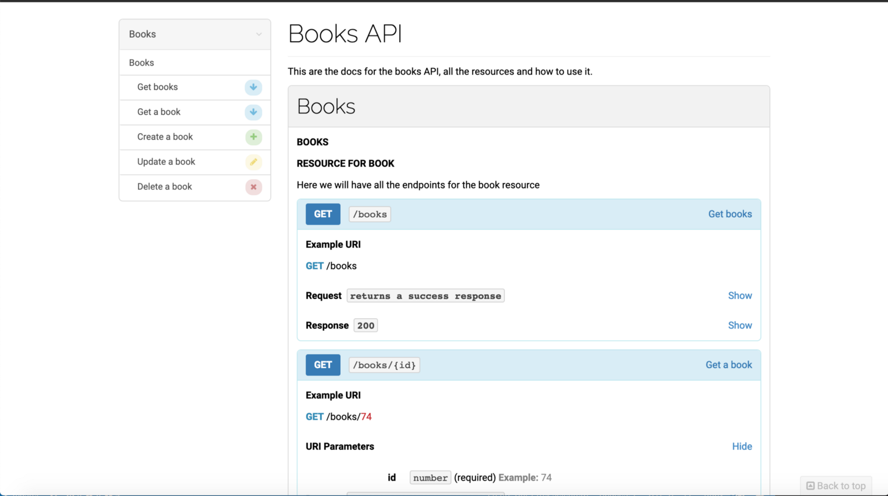

Hi in this post I would like to talk about a gem called <Link target="_blank" to="https://github.com/infinum/dox">dox</Link>, on college I’m creating a rails backend which is going to be consumed by an android app, and one of the requirements I was asked for this project was to document the API, all of the endpoints and things that the API sends and receive in order to work.

I never did something like that before but the first thing that came to my mind when I was doing the research, was that, of course rails is going to have a gem that can generate documentation for the API endpoints out of the box, after digging it for a few hours, I discover other gems that did the same but they did not fit on my requirements, or the usage of them was not one I was willing to, for example referencing them on the controller or creating a new subfolder in the spec directory with new tests just for the gem.

Dox was the one that I chose out of the others, because it generates all the documentation for you based in your tests generated with RSpec; even though it require to create new files under your spec folder, it integrates very easy with your existing tests. It is no magic though, because you need to configure it and there’s no much documentation for setting up the gem just the basics, so in this post I will talk how to integrate the gem on a rails API.

First of all we need to set the project:

```bash
$ rails new book-app --api -T --database=postgresql
```

After that we will need to integrate RSpec and dox in our Gemfile:

```ruby
group :development, :test do
# Rest of the gems on this block.....
  gem 'rspec-rails', '~> 3.8'
end
group :test do
  gem "dox", require: false
end
```

And then run the following commands to install it:

```bash
$ bundle install
```

```bash
$ rails generate rspec:install
```

If you’re reading this you should be familiar with the RSpec installation, I would not be doing a lot of RSpec related configuration, just the neccesary steps to integrate dox with your app.

On your rails helper file you need to configure dox in your rails_helper in order to integrate with RSpec.

```ruby
# spec/rails_helper.rb
require "dox" # This should go below the RSpec require

# This is telling RSpec to use all of the files in that folder you can name it as you want, in this case it will be "docs"

Dir[Rails.root.join("spec/docs/**/*.rb")].each { |f| require f }
RSpec.configure do |config|
  config.after(:each, :dox) do |example|
    example.metadata[:request] = request
    example.metadata[:response] = response
  end
end
# This last config is to specify which files are the ones which are going to be in charge to be associated with the created resource
Dox.configure do |config|
  config.header_file_path = Rails.root.join("spec/docs/descriptions/header.md")
  config.desc_folder_path = Rails.root.join("spec/docs/descriptions")
  config.headers_whitelist = ["Accept"]
end
```

That’s pretty much all the config we need to, so let’s generate a scaffold and run the migration to have something to document:

```bash
$ rails g scaffold Book title plot:text
```

```bash
$ rails db:migrate
```

So if everything worked you should see that the scaffold generated tests, in this case we will use the controller generated test, for learning purposes. The key for using Dox is that you need to specify which endpoint you want to document using your controller spec which if you’re scaffolding it will generate the whole resource.

Now we need to create a folder called docs in our spec folder, that folder will have another one called descriptions, these folder it’s going to have .md files that are the ones that are going to display static info under your docs, normally things that are about this resource, like a brief description for example. We will create our book.md file that is going to be associated to the scaffold we just create and we also need a header.md file that is going to have the title and the description for our API

```md
# spec/docs/descriptions/books.md

### Resource for Book

Here we will have all the endpoints for the book resource

# spec/docs/descriptions/header.md

# Books API

This are the docs for the books API, all the resources and how to use it.
```

Now that we have a description for our resource and our API description, we need to create in the docs folder a file for our books that is going to contain all the document structure for that resource.

```ruby
# spec/docs/books.rb
module Docs
  module Books
    extend Dox::DSL::Syntax
    document :api do
      resource "Books" do
        endpoint "/books"
        group "Books"
        desc "books.md" # This will point the description we created
      end
    end
    document :index do
      action "Get books"
    end
    document :show do
      action "Get a book"
    end
    document :update do
      action "Update a book"
    end
    document :create do
      action "Create a book"
    end
    document :destroy do
      action "Delete a book"
    end
  end
end
```

This is a simple file structure, you can create your own if you want to, these are like the sections our documentation is going to have for that resource.

In order to use dox we need to add it to our controller which is the one in charge of testing the actions above. We must add this file to the controller spec file, like this:

```ruby{3,7}
# spec/controllers/books_controller_spec.rb
RSpec.describe BooksController, type: :controller do
  include Docs::Books::Api # This referencing the document :api in the books.rb file in our docs folder
# Index Example using dox
 describe "GET #index" do
  include Docs::Books::Index # This is referencing the action we created under books.rb
    it "returns a success response", :dox do
      book = Book.create! valid_attributes
      get :index, params: {}, session: valid_session
      expect(response).to be_successful
    end
  end
end
```

Notice that we import the index we created under spec/docs/books.rb and that is telling dox that when we run that describe in RSpec we’re going to use map all the results in that block of the document. Notice that we need to add in the it statement , :dox in order to make it work.

Finally to create your documentation you need to run this command:

```bash
$ bundle exec rspec spec --tag apidoc -f Dox::Formatter --order defined --out public/api/docs/v1/apispec.md
```

That will create a new md file called apispec under public/api/docs/v1 and that will have an MD file containing all the documentation generated, you can create more resources and if you run the command it will be generated on that file as well.

So having an md file is great but what about mapping that md file to an html file? Sure we can do that with other tools, dox support three different renderers out of the box([Apiary](https://apiary.io/), [Aglio](https://apiary.io/), [Snowboard](https://github.com/bukalapak/snowboard)) and they are the ones in charge of creating an awesome page using that md file that we’ve just created. In this example I decided to use aglio, I have not try the others but they seem pretty cool as well.

For aglio you need to have node installed and npm, so you need to install it like a global package in order to use it everywhere, like in our rails project.

If you have it as a global package you need to run this command.

```bash
$ aglio --include-path / -i public/api/docs/v1/apispec.md -o public/api/docs/v1/index.html
```

After that you will have and index.html file in the folder where your md file is located public/api/docs/v1/ and if you open that file or go to that route when your server is running you should see something like this:



As you can see it generated a nice page for documentation, that is pretty easy to make, very quick to integrate to your existing project and it makes your unit tests even more useful as now they can help you to map a documentation.

I used this <Link target="_blank" to="https://github.com/infinum/dox-demo">repo</Link> for guidance.

My generated <Link target="_blank" to="https://github.com/jeanm182/Book-Example">repo</Link> for this tutorial.

You can see my college project documentation using dox <Link target="_blank" to="https://ticoplaces.herokuapp.com/api/docs/v1/">here</Link> (still in progress) with more resources.
