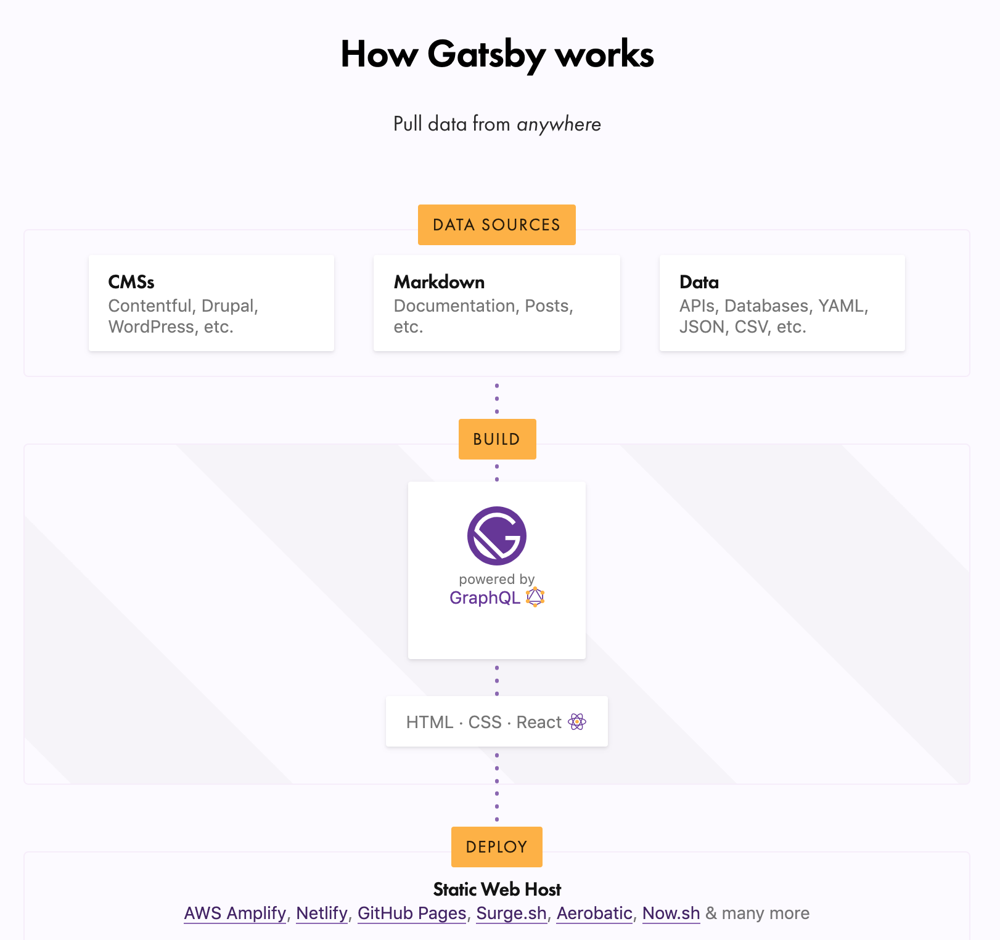
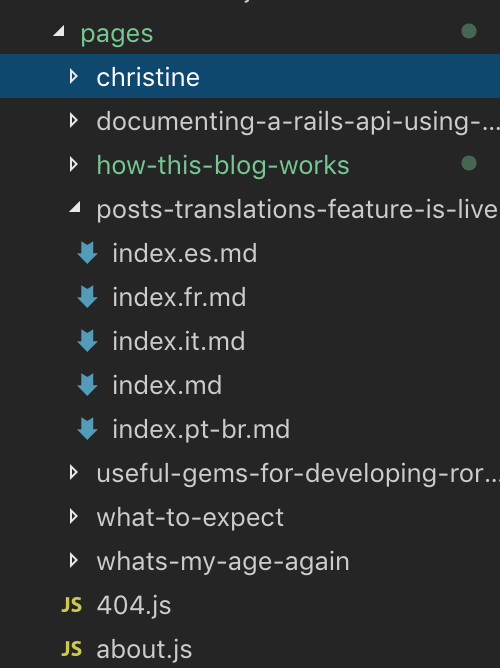

En este post gigantesco voy a explicar algunas cosas de mi blog, cómo esta construido y las soluciones que decidí implementar para crear los posts que ojalá esten leyendo.

Primero que todo, mi sitio web esta construido usando gatsby, ¿qué mierdas es gatsby? se estaran preguntando, Basicamente gatsby es un framework para construir sitios web estáticos, un sitio web estatico es una página que no sé conecta a una fuente de datos externa y que no tiene transacciones, lo podemos ver como una página de los años 90s que solo se encargaban de mostrar contenido. No tiene que lidiar con consumir datos de una fuente de datos externa(bueno en realidad gatsby si puede consumir datos en buena teoria, pero no lo he intentado).


Con esta imagen pueden llegar a tener una idea mas clara, cada post de la página esta hosteado en el mismo servidor, el rendimiento es bastante bueno y rápido, porque no tiene que consumir datos de otro lugar y tampoco contiene lógica de negocios compleja alojada en el servidor

### Herramientas básicas

My sitio web se basa en gran medida en JavaScript, el cual es un lenguaje de programación, uno de los tres pilares de la web y en React que es una librería de JavaScript. React se utiliza para crear interfaces de usuario, que en el desarollo se le conoce como frontend y basicamente es todo lo que usted ve cuando accesa a cierto sitio web.

La parte bonita de react es que nos permite a los desarolladores crear páginas web increíbles, rapidos y agradables, porque maneja los cambios bastante bien.

Como puedes notar my página es muy simple, es solo una página con todos los posts listados, pero si vas a alguno de los posts vas a notar que la carga de ellos es bastante rápida, no notas que el navegador carga cada vez que cambias de página, porque React es tan poderoso que solo actualiza el contenido que se necesita actualizar.


Con la imagen de arriba, se puede ver la belleza de React, no actualiza toda la página sino que solo actualiza la tabla, mostrando la película o películas que coinciden con el texto ingresado en el input.

### Evitando el uso de un CMS

Elegí usar **Gatsby**, en vez de utilizar **Wix** o **Wordpress** porque prefiero la flexibilidad que me da a la hora de crear mi propia página, en lugar de utilizar una herramienta que hace todo por uno, incluyendo un panel de administrador para manejar el contenido.

Mi blog es simple, no tiene nada de eso, No necesito ni quiero mucha complejidad para lidiar con ella, a la hora de crear posts, o hacer retoques a la interfaz, quería algo facil y mantenible sin tener que pelearme con los temas o decisiones complejas solo para modificar el diseño.

### ¿Qué es Gatsby?

Como expliqué gatsby es un framework para crear sitios web estáticos, utiliza React por debajo, el digrama de abajo muestra que puede extraer datos de todo lo que puedas imaginar.



En mi caso particular, estoy usando markdown, un lenguaje de marcas ligero. Todos mis posts están escritos en un archivo de extensión _md_. Es bastante facil de entender, porque lo que hace al final es convertir ese contenido a html. Puedes ver mas de lo que se puede hacer [aquí](https://github.com/adam-p/markdown-here/wiki/Markdown-Cheatsheet) y si estas mas interesado en mis links de traducciones, puedes ver como se ve en cualquiera de mis posts.

Gatsby tiene todas las herramientas modernas para crear algo, usando JavaScript, Webpack, React, CSS y un montón de plugins para hacer una página fabulosa. Incluso tienen [starters](https://www.gatsbyjs.org/starters/?v=2) que son proyectos ya configurados con la mayoría de cosas que se necesitan, en mi caso use el [gatsby-starter-blog](https://www.gatsbyjs.org/starters/gatsbyjs/gatsby-starter-blog/), el cual modifique, agregandole el tema oscuro y refactorizando algunos componentes.

Incluso introdujeron los [temas](https://www.gatsbyjs.org/docs/themes/introduction/) recientemente, es una funcionalidad de la cual no estoy familiarizado, a mi me parece como un starter, pero necesito sentarme a ver cuales son las diferencias.

Entonces, hablé mucho del framework pero no he explicado como funciona por debajo.

Gatsby usa **GraphQL**, un lenguaje de consulta que se encarga de consultar datos de alguna fuente de datos, en el caso particular de este blog sería el markdown y la metadata del sitio web. Eso significa que puedo hacer consultas de cualquiera de esa información y mostrarla en cualquiera de las páginas.

```graphql
query SiteMetadata {
  site {
    siteMetadata {
      title
      author
    }
  }
}
```

En este caso estoy consultando el nombre de mi sitio y el del autor del sitio, que soy yo, Gatsby viene con **GraphiQL** que es una herramienta para testear los queries, por ejemplo si correo ese query que les acabo de mostrar en mi programa, la respuesta esperada sería la siguiente:

```json
{
  "data": {
    "site": {
      "siteMetadata": {
        "title": "Loser Kid",
        "author": "Jean Aguilar"
      }
    }
  }
}
```

Esto retorna un _JSON_ con los campos que definí en el query y si hago este mismo query en alguno de mis componentes en React, voy a tener disponibles en los props, esos campos, es una manera bastante bonita y eficiente de consumir datos.

Por ultimo, pero no menos importante, voy a hablarles de algunos de los plugins que estoy utilizando, hay uno que se llama [gatsby-plugin-google-analytics](https://www.gatsbyjs.org/packages/gatsby-plugin-google-analytics/) que ayuda a integrar google analytics a nuestra página, muy facil de usar y una funcionalidad bastante importante para tener una idea de las personas que visitan mí sitio web.

Existe otro llamado [gatsby-transformer-remark](https://www.gatsbyjs.org/packages/gatsby-transformer-remark) que es el encargado de parsear nuestros archivos de markdown, esto permite la integración de GraphQL con los mismos, entonces se pueden realizar queries a atributos especificos, de ese archivo. Otra cosa genial es que los plugins también pueden tener otros plugins dentro, pro ejemplo yo estoy usando uno llamado [gatsby-remark-prismjs](https://www.gatsbyjs.org/packages/gatsby-remark-prismjs/) que usa una libreria que formatea los bloques de código en el markdown, entonces cada vez que vean uno de mis posts con bloques de código de una forma tan hermosa, ya saben que esta utilizando [PrismJS](https://prismjs.com/).

### Posts y traducciones.

Todos mis posts estan escritos en archivos de markdown, tienen una estructura, deberian tener un título, una descripción y una fecha, estos campos no son necesariamente requeridos, pero si se dejan en blanco van a mostrar cosas extrañas, por ejemplo si la fecha se deja en blanco, va mostrar el día antes de el inicio del Unix timestamp **31 de diciembre de 1969**, el título va ser el slug creado y la descripción va mostrar las primeras lineas del post. Entonces basicamente yo los añado siempre, porque creo que se ve mejor en general.

```md
---
title: Traducciones de los posts 🇨🇷 ~ 🇪🇸
date: "2019-05-08T20:05:00.169Z"
description: Traducciones totalmente funcionales.
---

_Advertencia:_ Ademas del ingles, español y un poco de portugues no sé nada de los otros lenguajes.

Hola, esta será un post breve para mostrar que las traducciones están funcionando, la mayoría de mis publicaciones estarán disponibles solo en español, pero creo que esta es una característica bastante cool que quería mostrarles (y bastante difícil en realidad).
```

Este es un ejemplo corto de como luce un archivo md en mi blog, se puede observar que al inicio tienen los campos que acabo de mencionar y que la sintaxis no es difícil de leer.

Escribir en markdown puede ser tedioso y aburrido, la mayoria de veces y por eso decidí añadir un plugin que actuaba como un CMS, con un registro incluido, entonces los administradores podian registrarse y eran capaces de escribir contenido para el blog, eso era bastante bueno porque dejaba añadir personas y que estas tuvieran permisos para crear y borrar posts, el UI era muy sencillo pero funcional. Al final quite el plugin porque, es mas fácil crear y editar los archivos de markdown y pushearlos de una vez al repo para publicarlos.

Yo creo que la funcionalidad de traducciones fue una de las mas difciles de implementar, Basicamente hice un copy paste, de la funcionalidad del [repo](https://github.com/gaearon/overreacted.io) de Dan Abramov (Código fuente del blog de Dan), aunque copié la mayor parte del código, entenderlo y tratar de atar todos los cabos sueltos fue un enormer desafio, basicamente hay un archivo con constantes que se llama _i18n.js_ que contiene un objeto con todas los lenguajes disponibles:

```js
exports.supportedLanguages = {
  en: "English",
  es: "Español",
  it: "Italiano",
  fr: "Français",
  "pt-br": "Português do Brasil",
}
```

Actualmente solo hay cuatro lenguajes soportados, pero añadir uno nuevo es bastante fácil, a no ser que la tipografía no este soportada, la cual puede ser un dolor en el trasero.

Dicho esto hay otro archivo llamado *i18n.js*😱😱😱mi culpa, lo sé, este contiene helpers para utilizar fonts distintos dependiendo del lenguaje, si es aplicable(ahora no hay ningun lenguaje que requiera un font personalizado), existe otro método para cambiar el URL del slug(un slug es un URL lindo), si estas leyendo un post traducido, por ejemplo todas las traducciones en español se encuentran en _https://www.loserkid.io//es/_ y el ultimo método es para mostrar el nombre del lenguaje de una manera bonita, en vez de utilizar el key del lenguaje, utilizamos el valor, por ejemplo en vez de mostrar _es_ se va a mostrar el valor _"Español"_.



Estoy utilizando esta estructura para organizar cada post, esto significa que cada traducción tiene su propio archivo, lo que las hace distintas, es el final, por ejemplo una traducción en español se llama _index.es.md_. Sí estas poniendo atención es el key de las constantes que estan en el archivo _i18n.js_ y lo mas importante a tener en cuenta a la hora de escribir los posts es que se tienen que llamar de acuerdo al lenguaje, inglés es el lenguaje por defecto, entonces _index.md_ siempre va ser la traducción en inglés.

Ahora bien, hay muchas cosas complicadas sucediendo para lograr mostrar el archivo de markdown correcto, honestamente hay ciertas cosas que ni yo logro entender, pero la forma corta de decirlo, es que hay una lógica personalizada, que le dice al sitio que use el markdown correcto, para el link de traducción, que se basa en gran medida al archivo de constantes y la convención creada para nombrar archivos de markdown.

### ¿Qué sigue después?

Ahora estoy bastante emocionado de la dirección que estoy tomando para este blog, creo que la mayoria de funcionalidad esta lista y eso apesta porque me gusta implementar nuevas funcionalidades. A medida que el contenido vaya creciendo, voy a añadir un paginador o algo para mantener el index lo menos cargado posible, tal vez añada una página de categorias o temas para organizar el blog, aunque eso implicaria cambios a al UI, entonces no estoy tan seguro si es una buena idea. Se debe notar que estoy muy feliz con el diseño, lo más difícil de todo es mejorar el contenido que se postea, este es mi primer artículo largo y no sé si hacerlo tan largo sea algo bueno, pero queria dar una eplicación de las herramientas y caminos que elegí para crear mi blog.

Estoy planeando hacer mas posts de React y tal vez sobre lo básico del desarollo web HTML, CSS y Javascript. No soy un profesonal y ni siquiera me acerco, pero se lo básico, entonces voy a tratar de hacerlos lo mas amigable para principiantes posible. Entonces si lograste leer hasta el final o por lo menos reviso lo que dice en este ultimo parrafo, lo invito a revisar mi blog frecuentemente para ver nuevas actualizaciones.
