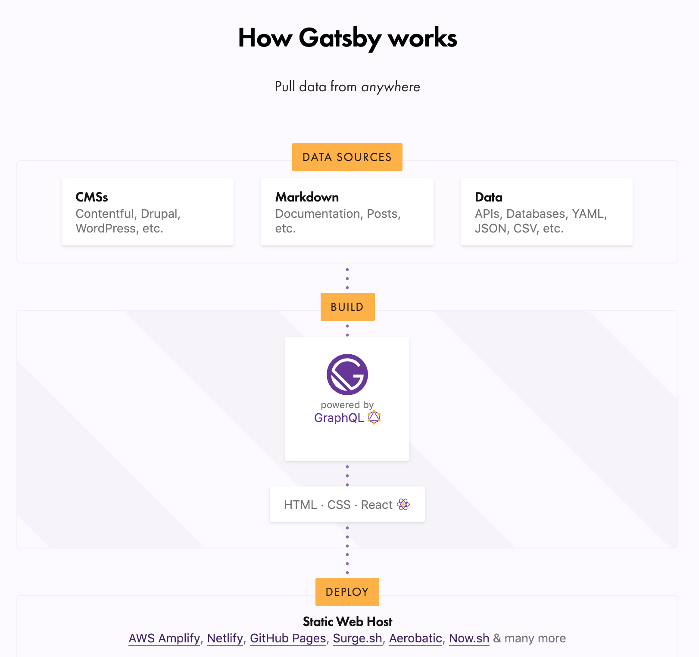

This gigantic post is going explain a few things of my site, how is it built and the approaches I took in order to create the posts you're hopefully reading.

First of all my site is built using gatsby. what the fuck is gatsby you would be thinking? So basically gatsby is a framework for building static sites, a static site is a plain old website which basically does not connect to any data source, you can think of it of an old 90's website which just display content, it does not deal with any fetch from a remote data source(well with gatsby you can but I have not tried that yet).


With this image you may get a clear idea, every post on my website is hosted on the same server, so the performance of it is pretty good and fast, because it does not have to fetch the data from another place and it also does not contain any complex business logic hosted in the server.

### Core tools

My site relies heavily on JavaScript which is a programming languages, one of the three pillars of the web and React which is a javascript library. React is used to build user interfaces, which in development that is known as frontend and basically is everything you see when you access to certain webpage.

The nice thing about it is that react allows developers to build awesome, fast and enjoyable websites because it handles changes very well.

As you may notice my site is pretty simple, just a landing page with all the posts listed, but if you go to any of my posts you'll see that the loading of it is pretty fast, you don't notice the browser loading everytime you switch to another page because react is so good that it just updates the content that it needs to be updated.


With the picture above you can see the beauty of react, it does not update the whole page, it just updates the table, displaying the movie or movies that matches with the text written in the input.

### Avoiding using CMS

I choose **Gatsby** instead **Wix** or **Wordpress** because I prefer the flexibility of building the site by my own, instead of using a tool that does everything for you, including a nice dashboard for administration purposes.

My blog is simple, it does not have any of that. I don't need nor want much complexity to deal with, when creating posts, or tweaking the interface, I wanted an easy mantainable site without having to deal with theming or complex decisions in order to tweak the design.

### What is gatsby?

As I explained gatsby is a framework for building static sites, it uses React under the hood, the diagram below shows that it pulls data from everything you could dream of.



In my particular case I'm using markdown a lightweight markup language. All of my posts are written in a file .md which is the markdown extension. It is fairly easy to understand, because in the end what markdown does is to convert that content to html. You can see more of what you can do [here](https://github.com/adam-p/markdown-here/wiki/Markdown-Cheatsheet) and if you're more interested on my translation links you can find how it looks on any of my posts.

Gatsby contains all the modern tools to build something with Javascript, Webpack, React, CSS and a lot of plugins to make your site awesome. They even have [starters](https://www.gatsbyjs.org/starters/?v=2) which are projects already configured with most of the things you need, in my case I used the [gatsby-starter-blog](https://www.gatsbyjs.org/starters/gatsbyjs/gatsby-starter-blog/) which I made some tweaks, including the dark theme and some refactoring.

They even introduced [themes](https://www.gatsbyjs.org/docs/themes/introduction/) recently, and it is a feature I'm not very familiar with, for me it looks like using a starter, but I need to figure out what are the differences.

So I'm talking a lot about the framework but I have not explain how it works under the hood.

Gatsby uses **GraphQL**, a query language that queries data from some data source, in this case it would be the markdown and the metadata I have on my site. That means I can query any of that info to display on any of my blog pages.

```graphql
query SiteMetadata {
  site {
    siteMetadata {
      title
      author
    }
  }
}
```

In this case I'm querying my site name and the author of the site which is me, gatsby comes with **GraphiQL** which is a tool that allows you to test your queries, for example if I test that query I just showed you, the expected output would be this one

```json
{
  "data": {
    "site": {
      "siteMetadata": {
        "title": "Loser Kid",
        "author": "Jean Aguilar"
      }
    }
  }
}
```

It returns a _JSON_ with the fields I asked for in the query and if I'm querying that on one of my react components, that would mean those values would be available in the props. it is a very cool and efficient way to fetch data.

Last but not least I'm going to talk about some the plugins I'm using, there's one called [gatsby-plugin-google-analytics](https://www.gatsbyjs.org/packages/gatsby-plugin-google-analytics/) that helps you integrating your site with google analytics, pretty straight forward and a very useful feature, to have some insights of the people visiting my website.

There's another one called [gatsby-transformer-remark](https://www.gatsbyjs.org/packages/gatsby-transformer-remark) that is the one in charge of parsing your markdown files, that allows the integration of GraphQL with the md files, so you are able the query specific things of that file. And another great thing to mention is that a plugin can also have plugins inside as well, so I'm using one called [gatsby-remark-prismjs](https://www.gatsbyjs.org/packages/gatsby-remark-prismjs/) which uses a library that is in charge of formatting the code, so whenever you see one of my posts containing code blocks in such a beauty way, you know it is using [PrismJS](https://prismjs.com/).

### Posts and translations.

All my posts are written in markdown files, they have an structure, they are supposed to have a title, a description and date, those fields are not necessarily required, but if you leave them blank, it will display strange things, for example the date it is going to display a day before the Unix time start **December 31, 1969**, the title is going to be the slug and the description will show the first lines of the blog. So basically I always add them because I think it looks better overall.

```md
---
title: Posts translations 🇺🇸 ~ 🇬🇧
date: "2019-05-08T20:05:00.169Z"
description: Translations fully functional.
---

_Warning:_ Besides English, Spanish and a little bit of Portuguese I do not know anything about the other languages.

Hi this is going to be a short post to showcase that translations are working, most of my posts will be available just in spanish but I believe this is a pretty rad feature I wanted to show you(and pretty hard actually).
```

This is a short example of how a md file looks like in my blog, notice that at the beginning there are the fields I just mentioned and how's the syntax not difficult to read.

Writing markdown can be tedious and boring, most of the times, and that's why I decided to add a plugin that acted like a CMS, so there was a register option, so all the admins registered were able to write content to the blog, that is pretty cool because that feature allows everyone who was invited to write and delete posts, the UI was simple but working. In the end I decided to remove the feature because it's better and faster to just create an MD file here and push to master to release the post.

I believe translations feature was one of the trickiest and difficult to implement, I basically copy paste, the functionality from Dan Abramov's overreacted [repo](https://github.com/gaearon/overreacted.io) (Dan's blog source code), even though I did copy most of the code, understanding the it, and tying up the loose ends was a huge challenge, basically there's a constants file called _i18n.js_ that contains an object with all the languages available:

```js
exports.supportedLanguages = {
  en: "English",
  es: "Español",
  it: "Italiano",
  fr: "Français",
  "pt-br": "Português do Brasil",
}
```

Currently there are just four languages supported but adding a new one is easy, unless the typography is no yet supported, which can be a pain in the ass.

With that being said there's another file called *i18n.js*😱😱😱 my bad I know, and that file contains helpers to use certain fonts for a language, if applicable(right now there's no language which requires custom fonts), a method to change the slug(a slug is a nice url) URL if you're reading a translated post, for example all spanish translations should be on _https://www.loserkid.io//es/_, and the last method is for displaying the language name in a nice way, instead of using the key of the language, use the value, example instead of displaying _es_ it is going to display the value _"Español"_


I'm using this folder structure for each post, that means that each translation has its own file, what sets them apart, is the naming at the end, for example the spanish translation is _index.es.md_. If you're paying attention is the key of the constants file located on the _i18n.js_ and that is the most important thing to keep in mind when writing posts, you should named them according the language, english is the default one so _index.md_ is the english translation.

Now there's a whole lot of complicated things going on in order to display the right markdown file, and honestly there are some things I don't even understand, but the short way is that there's some custom logic, that tells the site to use the right markdown file for the translation link which relies heavily in the constant file and the naming of the markdown files.

### What's up next?

Right now I'm pretty excited of the direction I'm taking for this blog, I believe that most of the functionality is set, and that sucks because I like to implement new features, as the content keeps growing I'll eventually add a paginator o something to keep the index as short as possible, maybe I'll add categories or topics for the blog so everything is more organized, even though that would imply UI changes as well, so I'm not very sure if that is a good idea. It should be noted that even I'm pretty happy with the design overall, the hardest thing to do is improving the quality of the content I'm posting, this is my very first long article, I don't know exactly if making such a long one is good, but I really want to give an overall explanation of the tools and paths I choose and took to built my blog.

I'm planning to do more posts of react, and maybe even the basics of web development HTML, CSS and Javascript. I'm not a pro and I'm not even close but I do know the basics, so I'll try to make them beginner friendly as possible. So if you managed to read until the end or you just like to go straight to the closing part, feel free to check my blog frequently to see new updates.
