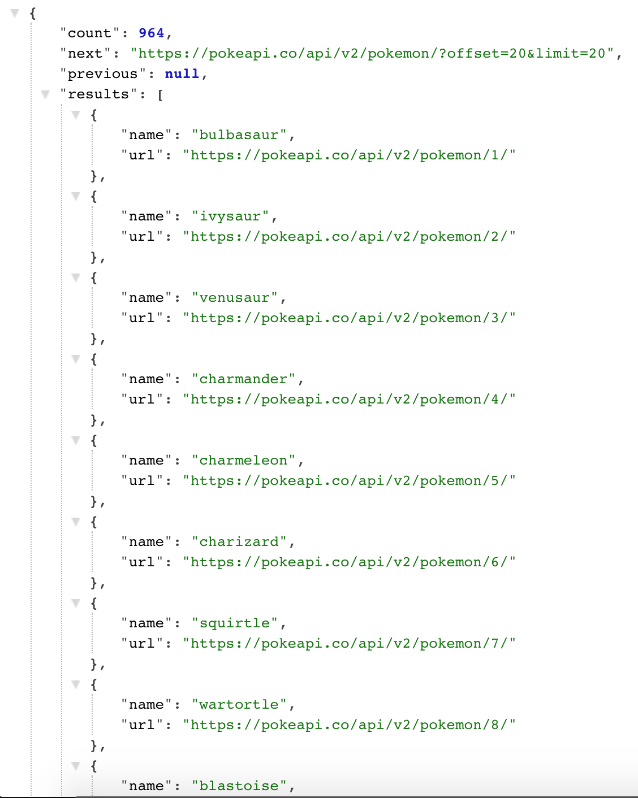

More on this series:

<Link to="/post/infinite-scrolling-redux-sagas-part-ii">Part II</Link>
<Link to="/post/infinite-scrolling-redux-sagas-part-iii">Part III</Link>

Lately I've been trying to create a pokedex, using redux, to practice the core concepts and try new things from an UI perspective.

Even though I will create a simple version of the dex I'm currently building, you will have grasp on what's the method I use to query large datasets, like for example the **+700** pokemon available. Lets get started.

We'll create a new react app, I will use the react create app, and when you have everything ready lets add the dependencies.

```bash
yarn add redux react-redux redux-logger redux-saga
```

Then we'll go through all the redux setup, as usual, we'll create a reducer for our pokemon list, and afterwards we will setup the store and wrap our app in the Provider component.

```bash
mkdir src/redux & mkdir src/redux/modules
touch src/redux/modules/pokemonList.js
```

We'll start writing the actions and the default state:

```js
// Actions types
const FETCH_POKEMON_LIST = "pokemon-frontend/pokemon/FETCH_POKEMON_LIST";
const FETCH_POKEMON_LIST_SUCCESS =
  "pokemon-frontend/pokemon/FETCH_POKEMON_LIST_SUCCESS";
const FETCH_POKEMON_LIST_FAILURE =
  "pokemon-frontend/pokemon/FETCH_POKEMON_LIST_FAILURE";
const LOAD_MORE_POKEMON = "pokemon-frontend/pokemon/LOAD_MORE_POKEMON";
const LOAD_MORE_POKEMON_SUCCEED =
  "pokemon-frontend/pokemon/LOAD_MORE_POKEMON_SUCCEED";
const LOAD_MORE_POKEMON_FAILED =
  "pokemon-frontend/pokemon/LOAD_MORE_POKEMON_FAILED";

const initialState = { pokemonList: [], isLoading: false, error: "" };
```

We define 6 actions, three of them are for the initial fetch, and the rest are for performing a new request everytime we hit the end of our scroll content. The initial state should be an empty array with a boolean for the loading status of the request and an error string just in case we get one exception.

After that we'll need to write the reducer, which is going to have the state changes that the store needs to do whenever an action is triggered.

```js
// Reducer
export default function reducer(state = initialState, action = {}) {
  switch (action.type) {
    case FETCH_POKEMON_LIST:
      return {
        ...state,
        isLoading: true,
      };
    case FETCH_POKEMON_LIST_SUCCESS:
      return {
        ...state,
        pokemonList: action.payload.data.results,
        isLoading: false,
      };
    case FETCH_POKEMON_LIST_FAILURE:
      return {
        ...state,
        error: action.payload,
        isLoading: false,
      };
    case LOAD_MORE_POKEMON:
      return {
        ...state,
        isLoading: true,
      };
    case LOAD_MORE_POKEMON_SUCCEED:
      const newPokemonList = action.payload.data.results;
      const { pokemonList } = state;
      return {
        ...state,
        pokemonList: [...pokemonList, ...newPokemonList],
        isLoading: false,
      };
    case LOAD_MORE_POKEMON_FAILED:
      return {
        ...state,
        error: action.payload,
        isLoading: false,
      };
    default:
      return state;
  }
}
```

If you're reading this you should be familiar with redux, the most important actions are the ones ending in `SUCCEED` PokeAPI returns a result like this one:


You see that the `data.results` will give us the list of pokemon and it's paginated as well, so that suits perfectly for our functionality, because everytime we go to the end of the scroll we will ask for the next page.

Another thing to mention is that when we succeed with the `LOAD_MORE_POKEMON` action we will have to merge the existing array with the one received in the new response, we use the spread operator for that purpose.

Next we need to define the action creators for the actions we've just created:

```js
// Action Creators
export function loadPokemonList() {
  return { type: FETCH_POKEMON_LIST };
}

export function loadPokemonListSucceed(payload) {
  return { type: FETCH_POKEMON_LIST_SUCCESS, payload };
}

export function loadPokemonListFailed(payload) {
  return { type: FETCH_POKEMON_LIST_FAILURE, payload };
}

export function loadMorePokemon(payload) {
  return { type: LOAD_MORE_POKEMON, payload };
}

export function loadMorePokemonSucceed(payload) {
  return { type: LOAD_MORE_POKEMON_SUCCEED, payload };
}

export function loadMorePokemonFailed(payload) {
  return { type: LOAD_MORE_POKEMON_FAILED, payload };
}
```

Most of our action creators receive a payload, only the `loadPokemonList` does not need a payload because request does not need any arguments to be triggered.

Last but not least we would add the sagas, we need one saga for every request and a main one which is going to be observing when an action is dispatched.

```js
import { call, delay, put, takeEvery, takeLatest } from "redux-saga/effects";

export function* fetchPokemonListSaga() {
  try {
    const response = yield call(getPokemonList);
    yield put(loadPokemonListSucceed(response));
  } catch (error) {
    yield put(loadPokemonListFailed(error.message));
  }
}

export function* loadMorePokemonListSaga(action) {
  const { payload } = action;
  try {
    const response = yield call(loadMorePokemonList, payload);
    yield delay(1000);
    yield put(loadMorePokemonSucceed(response));
  } catch (error) {
    yield put(loadMorePokemonFailed(error.message));
  }
}

export function* pokemonListWatcherSaga() {
  yield takeLatest(FETCH_POKEMON_LIST, fetchPokemonListSaga);
  yield takeEvery(LOAD_MORE_POKEMON, loadMorePokemonListSaga);
}
```

Redux saga is an awesome library to handle side effects, basically here we use the `call` effect to execute a promise, which in our case is the request to the endpoint(we'll define those functions later), everything is inside the try catch because given the promise result we either going to display an error message or a success response, by using the `put` effect; which is able to dispatch a redux action; what is cooler is that they have a `delay` effect which is going to add 1 second of delay, so we have time to tell the user that something is happening.

The last saga is the one which is observing when an action is dispatched and will trigger the saga associated to it, `takeLatest` only take the latest dispatch of the action associated and it will cancel any running sagas related to it while `takeEvery` does take every action associated with it, without cancelling it. This should be the expected behavior because if we're scrolling to fast we' dont want to cancel anything because we need to load every pokemon.

With that in mind let's setup the `mainReducer` and the `mainSaga`

```bash
touch src/redux/mainSaga.js &  touch src/redux/mainReducer.js
```

Lets edit the `rootSaga` file

```js
// rootSaga.js
import { all } from "redux-saga/effects";
import { pokemonListWatcherSaga } from "./modules/pokemonList";

export default function* rootSaga() {
  yield all([pokemonListWatcherSaga()]);
}
```

And lets edit the `rootReducer` file

```js
// rootReducer
import { combineReducers } from "redux";
import pokemonListReducer from "./modules/pokemonList";

const rootReducer = combineReducers({
  pokemonListReducer,
});

export default rootReducer;
```

Last but not least at least for the redux part, we will setup the store:

```bash
touch src/redux/configureStore.js
```

And then lets edit the file.

```js
import { createStore, applyMiddleware } from "redux";
import { createLogger } from "redux-logger";
import createSagaMiddleware from "redux-saga";

import rootReducer from "./rootReducer";
import rootSaga from "./rootSaga";

export default function configureStore(initialState = {}) {
  const middlewares = [];

  if (process.env.NODE_ENV === "development") {
    const logger = createLogger({ collapsed: true });
    middlewares.push(logger);
  }
  const sagaMiddleware = createSagaMiddleware();

  middlewares.push(sagaMiddleware);

  const store = createStore(
    rootReducer,
    initialState,
    applyMiddleware(...middlewares)
  );

  sagaMiddleware.run(rootSaga);

  return store;
}
```

Here we just imported our mainReducer and add the extra middleware (redux saga and redux-logger).

Now we need to create our endpoint, I personally like to use this setup:

```bash
yarn add axios humps
mkdir src/api
touch src/api/axiosInstance.js & touch src/api/pokemonEndpoints.js
```

The axiosInstance.js will be the one were we will set our default instance of axios with our custom config:

```js
import axios from "axios";
import humps from "humps";

const axiosInstance = axios.create({
  baseURL: "https://pokeapi.co/api/v2/",
  transformResponse: [
    ...axios.defaults.transformResponse,
    (data) => humps.camelizeKeys(data),
  ],
  transformRequest: [
    (data) => humps.decamelizeKeys(data),
    ...axios.defaults.transformRequest,
  ],
});

export default function api(method, url, data = {}, options = {}) {
  const httpMethod = method.toLowerCase();

  const hasData = ["post", "put", "patch"].indexOf(httpMethod) >= 0;
  const settings = hasData ? options : data;

  const request = hasData
    ? axiosInstance[httpMethod](url, data, settings)
    : axiosInstance[httpMethod](url, settings);

  return request;
}
```

This helper is to decamelize the response received because pokeAPI does not has the json format using camelcase. Also there's a custom function to pass the arguments we need to do a request.

```js
import API from "./axiosInstance";

export const getPokemonList = () => {
  return API("get", `/pokemon/?offset=0&limit=20`);
};

export const loadMorePokemonList = (limit) => {
  return API("get", `/pokemon/?offset=${limit}&limit=20`);
};
```

This two endpoints are basically the same, just that the `loadMorePokemonList` accepts an argument which in this case contains the amount of mon we want to load, we'll be incrementing by 20. Don't forget to add this export to the `pokemonList` module.

That's gonna be it for this tutorial, I hope you enjoyed this one and please stay tuned for the second part which is going to be focused on the component creation.
