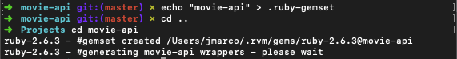
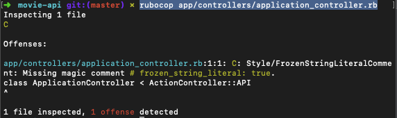
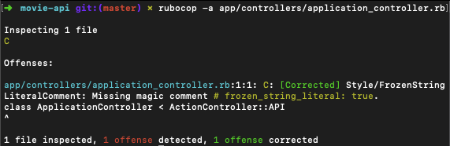
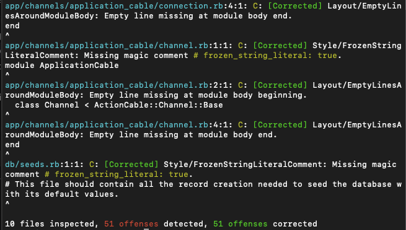

Más de estas series:
<Link to="/es/posts/rails-api-with-a-frontend-built-in-react-part-ii/">Parte II</Link>

Cuando estaba aprendiendo React, estaba un poco decepcionado porque no pude encontrar un buen tutorial de como integrar rails con react. Los unicos que encontré utilizaban todo dentro de rails(un app regular en rails con webpacker y rails-react). A pesar de que ese enfoque es bastante bueno y rápido de setear, no funciona como un API, sigue siendo una aplicación monolítica(todo esta en el app, el backend y el frontend). Al final con mucha investigación pude aprender como integrar estas herramientas, no fue tan dificil como yo creía y al ser un API, el proceso debe ser el mismo que cualquier otro framework o herramienta que envíe o reciba en formato JSON.

Entonces en estas series, les voy a enseñar como hacer un API en rails y conectarla con react, además voy a usar redux y redux-saga, las cuales son una de mis herramientas favoritas cuando uso React, voy a hacer unit tests y usar un linter para el API. No soy ningun erudito con las herramientas pero hacer un API básico con un frontend bonito si es algo que creo que les puedo enseñar.

## Construyendo el API

Primero que todo vamos a hacer el API, va a ser un API muy básico con películas y sus artistas, empezemos entonces. Estoy usando **Rails 5.2.3** y **Ruby 2.6.3**.

```bash
$ rails new movie-api -T -B --database=postgresql --api
```

La bandera -T es para decirle a rails que no utilicemos el test engine que trae por defecto _minitest_, ya que vamos a usar _RSpec_, la bandera -B quiere decir que no vamos a instalar las gemas cuando corremos el proyecto, la bandera --database es para elegir nuestra base de datos preferida y el --api es para crear un app en rails con solo las dependencias necesarias para construir un API.

Para la configuración inicial esto es lo que vamos a hacer:

1. Cuando tienes muchos proyectos de rails, cada uno con su entorno diferente, cada uno con versión de ruby distinta, quieres tener un gemset definido para cada uno, en este caso yo tengo RVM instalado en mi computadora y necesitamos especificarle a él nuestro gemset
2. Me gusta ignorar el database.yml, este es el archivo de configuración de base de datos para cada entorno de desarollo, este archivo no deberia estar revisado en nuestro controlador de versiones, ya que puede contener información de nuestra base de datos.
3. Por ultimo pero no menos importante, tenemos que añadir las dependencias para los tests unitarios y formato de código.

### Definiendo el gemset de ruby.

Viste que cuando corrimos el _rails new_ usamos -B para no instalar ninguna gema. Hicimos esto porque primero ocupamos decirle a RVM que nos cree un gemset específico para este proyecto(sino existe uno). _Un gemset es un contenedor que mantiene las gemas separadas por proyecto_, para evitar usar gemas globales. Para decirle a RVM que nos cree un gemset para el proyecto tenemos que correr, en el root del proyecto:

```bash
$ echo "movie-api" > .ruby-gemset
```

Esto crea un archivo llamado .ruby-gemset que es el que rvm usa para buscar un gemset llamado "movie-api", si existe, sino crea un nuevo gemset. Necesitas salirte del directorio y volver a entrar para ver los nuevos cambios:

```bash
$ cd ..
$ cd movie-api
```

Sí se hizo correctamente deberias ver algo como esto, despues de correr los comandos mencionados.



Esto significa que puedes correr bundle install y las gemas se instalaran en el gemset del proyecto que hicimos y no se van a romper dependencias de otros proyectos.

### Creando una plantilla del database.yml:

Con nuestro gemset list, ahora ocupamos ignorar nuestro database.yml, que esta localizado en el directorio de config. Vamos a crear un archivo de plantilla para guiar a los demas y vamos a ignorar el database.yml en git. En el root del proyecto vamos a correr esto para crear la plantilla nueva.

```bash
$ touch config/database.yml.template
```

El archivo deberia verse como un archivo _database.yml_, sin tocar y sin ningun password de ambiente o información sensitiva de la base de datos.

```yml
default: &default
  adapter: postgresql
  encoding: unicode
  pool: <%= ENV.fetch("RAILS_MAX_THREADS") { 5 } %>

development:
  <<: *default
  database: movie-api_development

test:
  <<: *default
  database: movie-api_test

production:
  <<: *default
  database: movie-api_production
  username: movie-api
  password: <%= ENV['MOVIE-API_DATABASE_PASSWORD'] %>
```

Ahora que tenemos la plantilla lista, tenemos que ignorar el database.yml, lo hacemos añadiendo la siguiente linea al .gitignore

```.ignore
# Ignore the local database.yml
/config/database.yml
```

### Creando el entorno de desarollo.

Necesitamos añadir RSpec y Rubocop para hacer pruebas unitarias y añadir estandares de código a nuestro proyecto.

Rubocop es una dependencia de desarollo, no la ocupamos para test y producción, por lo tanto vamos a añadir la gema en nuestro bloque de desarollo.

```ruby
group :development do
  # ..resto de las gemas de este bloque
  gem "rubocop", "~> 0.70.0", require: false
end
```

Vamos a tener que crear un archivo que se llama .rubocop.yml, que es el encargado de tener todas las reglas de rubocop, este archivo es de uno, por lo tanto se puede y debe modificar acorde a los estandares de código que queremos, muchas veces hay reglas que no nos interesa usar pero como mencione, es importante definir al menos algunas que ayuden que el repositorio sea mas consistente. Por ejemplo yo prefiero usar dos comillas en vez de la simple, esa es una regla que se va añadir al proyecto. El archivo este en el root del proyecto.

```bash
$ touch .rubocop.yml
```

Un par de reglas.

```yml
AllCops:
  Exclude:
    - "db/schema.rb"
    - "db/migrate/*.rb"
    - ".bundle/**/*"
    - "bin/**/*"
    - "vendor/**/*"
    - "**/config/**/*"
  TargetRubyVersion: 2.6

Rails:
  Enabled: true

Metrics/LineLength:
  Max: 130

Metrics/MethodLength:
  Max: 20
  Exclude:
    - "db/**/*"

Metrics/BlockLength:
  Max: 10
  Exclude:
    - "spec/**/*"
    - "config/routes.rb"
```

Basicamente el código de arriba es parte del rubocop.yml, define una serie de reglas para el proyecto, por ejemplo que una linea no puede sobrepasar mas de 130 palabras. Los otros también son sencillos de entender, como se puede ver tambien hay una parte que excluye ciertos archivos. En este caso por ejemplo decidí no meterme con ciertas carpetas generadas por rails y tampoco en las migraciones, porque son archivos que no se deben de tocar despues de haber sido publicados en el repo remoto.

Si quieres revisar todos los archivos del proyecto:

```bash
$ rubocop
```

Para revisar cierto archivo, en este caso el ApplicationController:

```bash
$ rubocop app/controllers/application_controller.rb
```

Esto deberia retornar una respuesta como esta, si existiese una ofensa, una ofensa es cuando el código no cumple con los estandares definidos en el .rubocop.yml



Bien, ahora que encontramos un error en el ApplicationController, como deberiamos de arreglarlo, lo podemos hacer manualmente o intentar lo siguiente:

```bash
$ rubocop -a app/controllers/application_controller.rb
```

El -a significa que corrija todos los archivos automaticamente, hay muchas ofensas que no pueden ser corregidos automaticamente, por lo tanto hay que hacerlo manual, como cuando un metodo o bloque es muy largo.



Ahora que sabemos bastante sobre rubocop vamos a tratar de corregir las ofensas, rails por defecto trae archivos que no cumplen con las reglas actuales de nuestro proyecto, esto no quiere decir que el código esta mal, solo que algunas de las reglas que yo estoy usando no estan siendo usadas por ellos. Entonces vamos a correr rubocop para tratar de arreglar todas las ofensas y veamos el resultado.



Rubocop fue capaz de arreglar todas las ofensas con solo correr un comando, es una herramienta bastante potente para nuestro API, porque ayuda que nuestro código sea consistente.

Ya con Rubocop instalado vamos a instalar RSpec para testear. Rspec se encarga de las pruebas unitarias, es bastante usado por la comunidad de rails y normalmente la mayoria de proyectos lo usan. Para hacer una aclaración RSpec y Rubocop son librerias de Ruby por lo que no estan atadas a rails y se pueden usar en cualquier proyecto hecho en Ruby.

Para añadir RSpec solo tenemos que agregarlo en el Gemfile en el grupo de development, test.

```ruby
group :development, :test do
  # ..resto de las gemas de este bloque
  gem "rspec-rails", "~> 3.8"
end
```

Ocupamos correr lo siguiente en el terminal:

```bash
# Descargar e instalar
$ bundle install

# Generar archivos de configuración
$ rails generate rspec:install
```

Vamos a tener varios archivos generados para RSpec, ahora deberiamos poder correr en el terminal:

```bash
$ rspec
```

Este comando es bastante inutil en estos momentos porque no tenemos nada que testear, en esta parte no vamos a hacer nada para testear pero añadiremos dependencias extra para que RSpec funcione mejor.

La primera gema es shoulda matchers, esta gema es bastante util para testear las asociaciones de un modelo y sus validaciones en el lado del servidor, que son bastante usadas en un proyecto de rails. Ocupamos agregar shoulda en nuestro Gemfile también:

```ruby
group :test do
  # ..resto de las gemas en este bloque
  gem "shoulda-matchers"
end
```

Despues de correr bundle install ocupamos decirle a RSpec que use los shoulda matchers en nuestra suite de tests, ocupamos agregar las siguientes lineas al rails_helper que se genero cuando instalamos RSpec.

```ruby
# Shoulda matchers configuration
Shoulda::Matchers.configure do |config|
  config.integrate do |with|
    with.test_framework :rspec
    with.library :rails
  end
end

# Add matchers configuration before this block
RSpec.configure do |config|
  # Bunch of code here....
end
```

Hay muchas formas de configurarlo, pero en este caso vamos a utilizar RSpec y rails. Con solo eso ya tenemos la gema integrada y lista para ser utilizada.

La segunda gema útil para testear se llama FactoryBot y nos ayuda a declarar y definir fixtures para nuestros modelos, por ejemplo si tenemos un modelo User con x cantidad de atributos, solo ocupamos agregar un factory con el modelo User, para poder invocarlo en nuestros tests. Este es un ejemplo de un factory User:

```ruby{9-11}
FactoryBot.define do
  factory :user do
    email { "johndoe@email.com" }
    password { "123456" }
    password_confirmation { "123456" }
    username { "johndoe" }
    uid { email }

    trait :without_username do
      username { nil }
    end
  end

end
```

Este factory nos ayuda a construir un usuario mientras corremos los tests, es bastante útil porque evita la duplicación del código y nos permite construir usuarios con casos especiales, en el ejemplo anterior podemos ver el código **reasaltado** es un caso especial cuando el username esta en blanco.

Para añadir factory bot a nuestro proyecto ocupamos ponerlo dentro del bloque de development y test, al igual que RSpec y luego correr bundle install

```ruby
group :development, :test do
  # ..rest of the gems in this block
  gem "factory_bot_rails"
  gem "rspec-rails", "~> 3.8"
end
```

Como con shoulda matchers, tenemos que añadirlos en el rails_helper.rb para poder utilizarlo con RSpec

```ruby
RSpec.configure do |config|
  # ...rest of the block
  # Factory Bot
  config.include FactoryBot::Syntax::Methods
end
```

Ahora que tenemos todo listo, voy a añadir una gema que va ser muy útil a la hora de crear seeds para la base de datos y llenarla con datos ficticios, la gema se llama **faker**. Solo ocupamos añadirla a nuestro gemfile en el bloque de development test.

```ruby
group :development, :test do
  gem "faker", git: "https://github.com/stympy/faker.git", branch: "master"
end
```

Yo sé que este post fue bastante largo y un poco aburrido porque es mas de setear todo, pero en el siguiente vamos a crear todo lo necesario para que nuestro modelo Movie funcione, ademas de los tests unitarios, vamos a usar **serializers** para mostrar el contenido en JSON y vamos a añadir soporte para **CORS**. Espero que les haya gustado este post y no olviden suscribirse.
