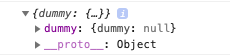

Más de estas series:
<Link to="/es/posts/rails-api-with-a-frontend-built-in-react-part-i/">Parte I</Link>

Esta es la parte 2 de la serie y en vez de continuar con el API, voy a empezar con el frontend, esto es porque hacer lo mismo es aburrido y quiero cambiar la manera de hacer tutoriales.

No soy ningun gurú en React entonces voy a usar `create-react-app` porque es la manera mas facil de setear el proyecto, ademas de otras librerías que también vamos a utilizar para que el proyecto funcione.

Empecemos entonces, revisa que tu versión de node sea la ultima y que tengas npm-yarn instalado para correr lo siguiente:

```bash
$ npx create-react-app movie-frontend
$ cd movie-frontend
```

Con esto seran capaces de correr un servidor en http://localhost:3000/, yo uso yarn pero también se puede usar npm.

```bash
$ yarn run start
```

## Removiendo basura innecesaria

Ahora, vamos a remover cosas que no estamos utilizando. En este caso vamos a borrar todos los archivos css y el logo.svg, que esta en el directorio src, ademas de todas las referencias en el código. Deberia verse como la imagen de abajo.


Ahora actualicemos nuestro App.js y el index.js

```jsx
// App.js
import React from "react"

function App() {
  return (
    <div className="App">
      <h1>Movie App</h1>
    </div>
  )
}

export default App
```

```jsx
// index.js
import React from "react"
import ReactDOM from "react-dom"
import App from "./App"
import * as serviceWorker from "./serviceWorker"

ReactDOM.render(<App />, document.getElementById("root"))

// If you want your app to work offline and load faster, you can change
// unregister() to register() below. Note this comes with some pitfalls.
// Learn more about service workers: https://bit.ly/CRA-PWA
serviceWorker.unregister()
```

Nótese que acabamos de remover los imports de css y el logo, modificando nuestro componente para mostrar un **h1**

## Añadiendo un linter a nuestro codigo.

En el caso de nuestro proyecto vamos a usar prettier, que es un formateador de código con opinionado, que le va dar consistencia a lo que escribimos.

```bash
$ yarn add --dev --exact prettier
```

Con prettier añadido, vamos a crear un script para revisar todos nuestros archivos con prettier, modifiquemos nuestro `package.json`.

```json
  "scripts": {
    //...rest of the scripts
    "format": "prettier --write src/**/*.{js,jsx}"
  },
```

Finalmente, creemos un archivo para darle un par de reglas a nuestro código, voy a usar las que vienen con el starter blog de gatsby porque soy perezoso.

```bash
$ touch .prettierrc
```

Las reglas:

```json
{
  "endOfLine": "lf",
  "semi": false,
  "singleQuote": false,
  "tabWidth": 2,
  "trailingComma": "es5"
}
```

Ahora tenemos prettier para correrlo en nuestro CMD, con el siguiente comando

```bash
$ yarn run format
```

Que va producir una respuesta como esta.


## Dandole estilos a nuestra aplicación

La aplicación se ve bastante mal en estos momenots, así que cambiemos unas cosas para hacer todo mas ordenado y bonito.

Como siempre no rompamos la manera usual o facil de hacer un tutorial de frontend, vamos a usar boostrap. Me gusta instalarlo como paquete de npm, porque de esa forma puedo modificar las variables usando scss. Ocupamos soporte para archivos de este tipo.

```bash
$ yarn add node-sass
```

Ahora vamos a crear un archivo scss para darle estilo a nuestra aplicación y lo vamos a importar en el archivo de `App.js`.

```bash
$ mkdir src/styles
$ touch src/styles/main.scss
```

```jsx
// App.js
import React from "react"
import "./styles/main.scss"

// Rest of the code
```

Ahora vamos a reiniciar el server y todo deberia funcionar sin problemas(solo vamos a tener un UI no muy lindo) el cual no vamos a tocar en este post.

Bootstrap es una librería de frontend para crear sitios responsive y bonitos, trae componentes que nos dejan ponerle estilos de una forma bastante facil. A pesar de que es una gran herramienta, no es magico, añadir bootstrap es bastante facil pero hay que señalar un par de cosas primero

1. Bootstrap usa JQuery y Jquery es una librería de javascript, que a diferencia de react, manipula el DOM directamente. React utiliza algo llamado virtual DOM y en buena teoria funciona mejor, porque solo actualiza ciertas partes del DOM. No es recomendable combinarlos. Ver este [artículo](https://medium.com/@wisecobbler/if-you-think-you-need-jquery-in-your-react-app-you-re-doing-it-wrong-77899ed7217e) o [este](https://programmingwithmosh.com/javascript/react-vs-jquery-how-they-compare/) para mas detalles.
2. Con JQuery fuera del panorama, vamos a perder ciertas funcionalidades de bootstrap, todas las que usan JS(porque usan Jquery), por ejemplo los modales.
3. Como vamos a usar bootstrap sin las funcionalidades que nos ofrece via javascript? Bueno, por suerte existen librerías que estan hechas para integrar bootstrap las funcionalidades de JS con React, una es [React Bootstrap](https://react-bootstrap.github.io/) la cual se encuentra en su versión beta y [Reacstrap](https://reactstrap.github.io).
4. Esas librerías ofrecen componentes fuera de la caja, como el NavBar, Modales, Dropdowns, Columnas y Tablas.
5. Basado en mi experiencia, creo que es mejor y mas flexible tratar de evitar el uso de los componentes que traen esas librerías, a menos que se ocupe alguna funcionalidad de javascript, porque el nucleo de sus componentes no son tan flexibles para modificar.
6. Usar alguna de estas librerías es casi que mandatorio, a no ser que planees implementar las funcionalidades de JS que ofrece bootstrap de nuevo.
7. Con esto dicho, bootstrap es bastante bueno, su grid system, las utilidades de flex, utilidades de espacio, lo hacen bastante agradable para trabajar.

Agreguemos bootstrap

```bash
$ yarn add bootstrap
```

Ahora tenemos que importar bootstrap en nuestro archivo main.scss

```scss
// main.scss
@import "~bootstrap/scss/bootstrap";
```

Con los archivos de bootstrap importados en nuestro scss, ahora vamos a ser capaces de utilizar todos los helpers que bootstrap ofrece y si reinicias el server, vas a notar que la tipografía cambió para la que bootstrap usa.

Usar sass con bootstrap nos permite modificar las variables que utiliza bootstrap, por ejemplo los colores del tema, pero igual se pueden modificar otro montón de cosas, puedes ver que se puede hacer [aquí](https://getbootstrap.com/docs/4.3/getting-started/theming/). Vamos a crear un archivo de variables para agregar las nuestras y sobreescribir las de bootstrap.

```bash
$ touch src/styles/_variables.scss
```

```scss
// _variables.scss
$primary: #71eeb8;
$secondary: #ffa7c4;
$info: #64b5f6;
$danger: #d23669;
$warning: #ffcc99;

// Bootstrap overrides
$theme-colors: (
  primary: $primary,
  info: $info,
  secondary: $secondary,
  danger: $danger,
  warning: $warning,
);
```

Para ver los cambios tenemos que importat el archivo que acabamos de crear en nuestro main.scss, debe estar en el principio, antes del importe de bootstrap.

```scss
@import "variables";

@import "~bootstrap/scss/bootstrap";
```

Ahora si modificamos el h1 en App.js con esto

```jsx
function App() {
  return (
    <div className="App">
      <h1 className="text-primary">Movie App</h1>
    </div>
  )
}
```

Vamos a ver algo como:


Nótese como cambio el azul por defecto de bootstrap a el color primario que definimos en el archivo \_variables.scss.

## Redux para manejar el estado global.

Vamos a añadir redux a nuestra aplicación para tener una herramienta que permita el manejo del estado globalmente.

```bash
$ yarn add redux react-redux redux-logger
```

Estamos añadiendo a su vez, los bindings necesarios para que funcione con React y a su vez una librería que se llama redux-logger que genera logs cuando una acción se activa.

Ahora, la manera en que yo aprendí redux, fue siguiendo este [patrón](https://github.com/erikras/ducks-modular-redux), basicamente es tener todo el boilerplate de redux en un lugar, para un cierto reducer. Me gusta este patrón ya que todo esta contenido en modulos, en vez de estar añadiendo archivos en distintos lugares, ahora si estas acostumbrado en hacerlo en la manera normal, también esta bien, es solo otra forma distinta de hacerlo.

Creemos las dos carpetas:

```bash
$ mkdir src/redux
$ mkdir src/redux/modules
```

Vamos a empezar generando un modulo llamado `dummy`, esto nos va a ayudar a tener un proyecto con el boilerplate necesario para ser reutilizado en otro proyecto, ademas vamos a agregar una librería llamada redux-actions que nos permite utilizar ciertos helpers para construir los modulos(no es necesario, pero permite hacer las cosas mas rápido).

```bash
$ touch src/redux/modules/dummy.js
$ yarn add redux-actions
```

En este archivo vamos a añadir todo lo necesario para este modulo, las acciones, el reducer, los action creators y las sagas.

```js
// dummy.js
import { handleActions, createAction } from "redux-actions"

// Actions
export const DUMMY_ACTION = "movie-frontend/dummy/DUMMY_ACTION"

// Initial State
export const getInitialState = () => {
  return {
    dummy: null,
  }
}

// Reducer
const reducer = handleActions(
  {
    [DUMMY_ACTION]: (state, action) => {
      const { dummy } = action.payload
      return {
        ...state,
        dummy: dummy,
      }
    },
  },

  getInitialState()
)

export default reducer

// Action Creators
export const dummyAction = createAction(DUMMY_ACTION)
```

Ahora que tenemos nuestro módulo listo, ocupamos crear el rootReducer, que es un contenedor para todos nuestros reducer que habitan en los modulos.

```bash
$ touch src/redux/rootReducer.js
```

```js
// rootReducer.js
import { combineReducers } from "redux"

import dummy from "./modules/dummy"

const rootReducer = combineReducers({
  dummy,
})

export default rootReducer
```

Ahora agreguemos redux-saga, esta es una librería que nos ayuda a manejar efectos secundarios. Los efectos secundarios son funciones que modifican cosas que estan fuera de nuestro poder o contexto. Puede ser un poco complejo al principio pero es una de las librerías mas utiles que puedes encontrar. Con este tutorial vas a tener una idea mas clara de como funcionan, entonces sigue leyendo estos tutoriales para conocer mas acerca de ellas.

```bash
$ yarn add redux-saga
```

Con redux-saga en nuestro proyecto, agreguemos una dummy saga en nuestro módulo dummy.

```js
// dummy.js
import { handleActions, createAction } from "redux-actions"
import { takeEvery, all } from "redux-saga/effects"

/* Rest of our code */

// Sagas
export function* createDummySaga(action) {
  // We'll have all the logic to call the side effect from here
}

// Saga
export function* dummySaga() {
  yield all([takeEvery(DUMMY_ACTION, createDummySaga)])
}
```

Lo que estamos haciendo aquí es que la función dummySaga() esta observando a la acción que esta asociada adentro, entonces cada vez que se active DUMMY_ACTION se va ejecutar createDummySaga(), podemos añadir cuantas sagas queramos en nuestra dummySaga().

Ahora creemos nuestro contenedor para las sagas.

```bash
$ touch src/redux/rootSaga.js
```

```js
// rootSaga.js
import { all } from "redux-saga/effects"
import { dummySaga } from "./modules/dummy"

export default function* rootSaga() {
  yield all([dummySaga()])
}
```

Con todo esto creado necesitamos crear el `store` y envolver nuestra aplicación en un componente llamado Provider, que es el que va permitir tener el `store` dentro de la aplicación.

```bash
$ touch src/redux/setupStore.js
```

```js
import { createStore, applyMiddleware } from "redux"
import { createLogger } from "redux-logger"
import createSagaMiddleware from "redux-saga"
import rootSaga from "./rootSaga"

import rootReducer from "./rootReducer"

export default function setupStore(initialState = {}) {
  let middlewares = []

  if (process.env.NODE_ENV === "development") {
    const logger = createLogger({ collapsed: true })
    middlewares.push(logger)
  }
  const sagaMiddleware = createSagaMiddleware()

  middlewares.push(sagaMiddleware)

  const store = createStore(
    rootReducer,
    initialState,
    applyMiddleware(...middlewares)
  )

  sagaMiddleware.run(rootSaga)

  return store
}
```

Este archivo es el encargado de devolvernos el `store` con todo el middleware asociado, como punto importante hay que ver como introducimos el middleware de redux saga y el middleware de redux logger, que nos ayuda a integrar esas funcionalidades con redux.

```jsx{2,10,12}
import React from "react"
import { Provider } from "react-redux"
import setupStore from "./redux/setupStore"
import "./styles/main.scss"

const store = setupStore()

function App() {
  return (
    <Provider store={store}>
      <h1 className="text-primary">Movie App</h1>
    </Provider>
  )
}

export default App
```

Sí todo fue hecho correctamente, el proyecto deberia seguir funcionando, sin ningun tipo de error, puedes ver si la parte de redux funciona correctamente añadiendo este simple log de consola debajo de la declaración del store.

```jsx{7}
import React from "react"
import { Provider } from "react-redux"
import setupStore from "./redux/setupStore"
import "./styles/main.scss"

const store = setupStore()
console.log(store.getState())

/* Rest of the code*/
```

Esto deberia imprimir todos los reducers que estan contenidos en el rootReducer, con su estado inicial.



¿Bastante bueno verdad?

## Creando variables de ambiente

Esto es algo bastante importante, porque no queremos albergar variables confidenciales en nuestro repositorio, por ejemplo el url del API, entonces vamos a crear un archivo .env para especificar esa variable.

```bash
$ touch .env
```

`
REACT_APP_API_URL=http://localhost:3000/
`

Esto es un ejemplo bastante sencillo pero ten en cuenta que puede ser util si estas lidiando con datos que quieres esconder a terceros.

## Instalando Axios

Esta parte es mas que todo para tener todo corriendo y el setup listo, ocupamos axios, porque es el que nos va a ayudar a hacer requests al API.

```bash
$ mkdir src/api
$ touch src/api/api.js
$ yarn add axios humps
```

Como puedes ver tambien se añadio una librería llamada humps, esto es para solucionar un problema que suele suceder cuando trabajamos con lenguajes diferentes(ruby y js), usualmente cuando usas ruby, las variables usan una convención de snakecase.

```ruby
  my_number = 0
```

Mientras tanto en JS se usa camelcase

```js
myNumber = 0
```

Esto conlleva a un gran problema, cuando consumimos el API, vamos a tener el dilema de elegir un estandar para todo, sea camelcase o snakecase, lo cual no es conveniente, ya que estariamos sobrescribiendo la convención de alguno de los dos lenguajes. Humps nos ayuda de la parte de js para convertir underscore a snakecase y viceversa. Entonces para hacer que esa conversión sea automática ocupamos crear una instancia de axios que utilice humps para transformar respuestas, todo esto lo hacemos en el archivo que acabamos de crear `api.js`.

```js{5,8,12}
import axios from "axios"
import humps from "humps"

const API = axios.create({
  baseURL: process.env.REACT_APP_API_URL,
  transformResponse: [
    ...axios.defaults.transformResponse,
    data => humps.camelizeKeys(data),
  ],
  transformRequest: [
    data => humps.decamelizeKeys(data),
    ...axios.defaults.transformRequest,
  ],
})
```

Aquí podemos ver como se utiliza la variable de entorno para setear nuestro endpoint y como utilizamos humps para transformar el request y el response en las lineas marcadas.

## Terminando

Si lograste llegar hasta aquí o solo quieres un resumen de lo que se hizo, esto fue lo que paso, creamos una app de react, integramos redux y un poco de middleware para este, ademas ahora usamos scss en vez de css y añadimos axios como librería por defecto para hacer requests al API, utilizando variables de entorno para esconder el endpoint. Espero que hayas encontrado este post útil y no olvides de suscribirte y mantenerte en contacto para sugerencias y mejoras.
