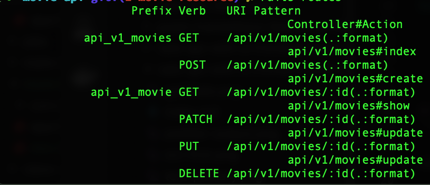
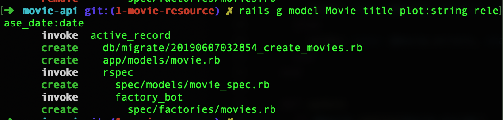
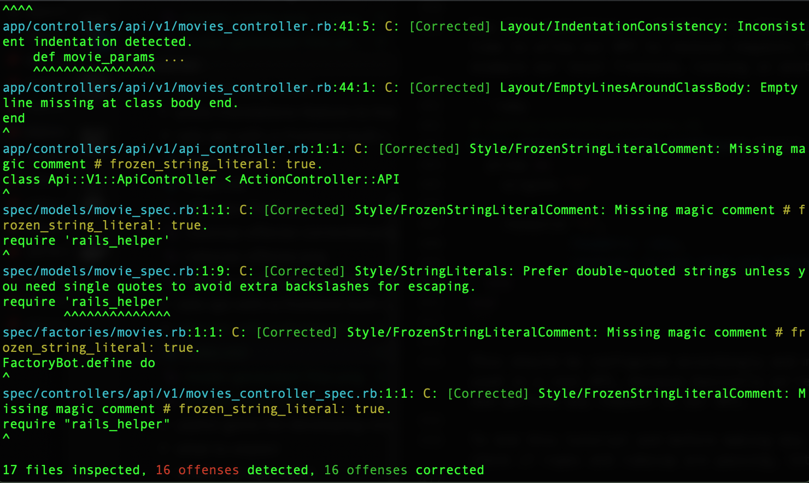
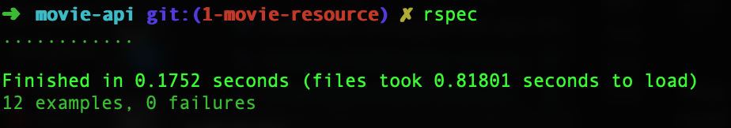

More on this series:
<Link to="/posts/rails-api-with-a-frontend-built-in-react-part-i/">Part I</Link>
<Link to="/posts/rails-api-with-a-frontend-built-in-react-part-ii/">Part II</Link>
<Link to="/posts/rails-api-with-a-frontend-built-in-react-part-iv/">Part IV</Link>

In this post we will be adding a Movie resource to our API. Let's modify our routes file in config/routes.rb

```ruby
Rails.application.routes.draw do
  namespace :api do
    namespace :v1 do
      resources :movies
    end
  end
end
```

If we run rails routes we should be able to see something like this



Lets create a new controller to be the one to do our API stuff.

```bash
$ mkdir app/controllers/api
$ mkdir app/controllers/api/v1
$ touch app/controllers/api/v1/api_controller.rb
```

First we created two new directories for namespacing our API, it is important to do it if we are planning to version the API and also if we plan future releases. We created a new controller called ApiController which is the one we will be inheriting from, just leave it like this. Namespacing is very important in order for this to work.

```ruby
class Api::V1::ApiController < ActionController::API
end
```

### Movie model.

Now we're going to create our first model, the Movie model, our movie will have a title, a plot and a release date, at least for now.

```bash
$ rails generate model Movie title plot:string release_date:date
```

It should generate four new files, one containing the migration, two for our tests and the file for the model.



Now let's create our database and then apply the new migration.

```bash
$ rails db:create
$ rails db:migrate
```

After that we need to add some validations, the title and the date must be required fields.

```ruby
class Movie < ApplicationRecord

  validates :title, :release_date, presence: true

end
```

### Testing models with shoulda matchers.

For testing the validations we just made, we're going to be using shoulda matchers, one of the gems added in the last tutorial(one liners tests for rails), by modifying our newly generated file _spec/models/movie_spec.rb_

```ruby{3,4}
RSpec.describe Movie, type: :model do
  describe "validations" do
    it { is_expected.to validate_presence_of(:title) }
    it { is_expected.to validate_presence_of(:release_date) }
  end
end
```

Notice how in the it statements we added a describe block with two lines for validating the presence of our fields, that's how shoulda matchers works, it lets you write a simple readable one line to test the functionality of your rails app.

### Creating our first factory.

Now that we have that, we need to modify the other test file that was generated by us when we run the rails generate model, this is a factory file, and we're going to modify it a bit. Thats when faker comes in handy, because it lets us fill the factory with dummy data in order to be used in the tests, in this way we can create tests using different data values, it is important to be careful though, because faker does not have unlimited data values, so there's a possibility to create duplicate values, and if one of our models validates the uniqueness of a certain field, the test can break because there's already a resource with that name; Anyways that's how the file should look like(There's no movie names in faker gem, so I'm using Book names instead).

```ruby
FactoryBot.define do
  factory :movie do
    title { Faker::Book.title }
    plot { Faker::Lorem.paragraph }
    release_date { Faker::Date.birthday(18, 65) }
  end
end
```

### Seeding the database.

Now that you see that faker can generate fake data, let's create some seeds for our movies in _db/seeds.rb_

```ruby
10.times do
  Movie.create(
    title: Faker::Book.title,
    plot: Faker::Lorem.paragraph,
    release_date: Faker::Date.birthday(18, 65),
  )
end
```

Finally run this command to add the fake movies

```bash
$ rails db:seed
```

### Creating the movie controller.

Great, now its time to create a controller for our Movie model, we're going to add a new file called movies_controller.rb in our api namespace.

```bash
$ touch app/controllers/api/v1/movies_controller.rb
```

This controller will be on charge of displaying, editing, adding and deleting movie resources, for tutorial purposes I will not explain how a regular controller works, I'm just goingt to show you the actual code.

```ruby
class Api::V1::MoviesController < Api::V1::ApiController
  before_action :set_movie, only: %i[show update destroy]

  def index
    @movies = Movie.all

    render json: @movies
  end

  def show
    render json: @movie
  end

  def create
    @movie = Movie.new(movie_params)

    if @movie.save
      render json: @movie, status: :created
    else
      render json: @movie.errors, status: :unprocessable_entity
    end
  end

  def update
    if @movie.update(movie_params)
      render json: @movie
    else
      render json: @movie.errors, status: :unprocessable_entity
    end
  end

  def destroy
    @movie.destroy
  end

  private
    def set_movie
      @movie = Movie.find(params[:id])
    end

    def movie_params
      params.require(:movie).permit(:title, :plot, :release_date)
    end
end
```

If you're familiar with the framework this code should not surprise you, and is this your first rails API you can see that we're rendering JSON instead of a regular html view, the rest is just a regular controller logic flow.

### Serializers

In order to display that we are going to use a gem called **_active_model_serializers_**, which is a gem that is going to allow us to modify which content should be displayed in our JSON responses.

```ruby
# Rest of the gems
gem "active_model_serializers", "~> 0.10.0"
```

After bundling that new gem, we're going to create a new serializer for our Movie resource, but first lets see how a regular response looks at the moment, we can check that using postman, curl or whatever you want, just start your rails server. And try to make a get request to this URL: http://localhost:3000/api/v1/movies/1 and your output should be similar to the following:

```json
{
  "id": 1,
  "title": "In Death Ground",
  "plot": "Maxime nulla architecto. Sit et et. Et vero reiciendis.",
  "release_date": "1979-03-29",
  "created_at": "2019-06-07T04:22:30.850Z",
  "updated_at": "2019-06-07T04:22:30.850Z"
}
```

Notice that we're displaying everything in the response, this is not a good idea because there can be some cases where we want to hide certain information in our response. Because of that we're using serializers, it is worth to mention that sometimes people prefer to use Jbuilder which basically is creating instead of an **html.erb** file one with an extension of **json.jbuilder** under the views folder. While this approach is also a good one, I prefer to use the serializers because I don't like the idea of creating files in the views folder. If we're making an API, sounds kind of dumb, even though it is a completely valid approach, for me it does not make sense to use the views folder in an API only application.

Lets create our serializer file.

```bash
$ mkdir app/serializers
$ touch app/serializers/movie_serializer.rb
```

Now lets edit our newly created file

```ruby
class MovieSerializer < ActiveModel::Serializer

  attributes :id, :title, :plot, :release_date

end
```

Now if we try to perform the same get request we should get something like this:

```json
{
  "id": 1,
  "title": "In Death Ground",
  "plot": "Maxime nulla architecto. Sit et et. Et vero reiciendis.",
  "release_date": "1979-03-29"
}
```

Notice that in our new response we're omiting the created_at and the updated_at fields, because we did not specify them in our serializer.

### RSpec controller test

If you want to play with the functionality of the controller actions feel free to do so, I'll skip that part to show you how to start testing the controller in the application. Lets create the test file.

```bash
$ mkdir spec/controllers
$ mkdir spec/controllers/api
$ mkdir spec/controllers/api/v1
$ touch spec/controllers/api/v1/movies_controller_spec.rb
```

Now the basic tests controller structure is this one(notice the namespacing like in the controller)

```ruby
require "rails_helper"

RSpec.describe Api::V1::MoviesController, type: :controller do
  # Your tests
end
```

This is the basic structure, normally when you test controllers you need to ensure that all the actions are tested, lets start defining attributes for our object, this will allow to test when we're performing POST or PUT actions.

```ruby
RSpec.describe Api::V1::MoviesController, type: :controller do
  let(:valid_attributes) do
    {
      title: "American Pie",
      plot: "Teen Comedy",
      release_date: "09-06-1999",
    }
  end

  let(:invalid_attributes) do
    { release_date: nil }
  end
end
```

Here we're instantiating two variables to be available to use in the describe blocks of our actions, these are working la global variables for this file.

Now lets start writing some actions, first we're going to add the index and show actions.

```ruby
RSpec.describe Api::V1::MoviesController, type: :controller do
  # Rest of the code
  describe "GET #index" do
    it "returns a success response" do
      get :index, params: {}
      expect(response).to be_successful
    end
  end

  describe "GET #show" do
    it "returns a success response" do
      movie = create(:movie)
      get :show, params: { id: movie.to_param }
      expect(response).to be_successful
    end
  end
  # Rest of the code
end
```

In this two describe blocks we're performing a get request to our index and show actions, the index does not require any params to work so we're not sending anything, the show action by counterpart does need one param, which we in rails by default is the _:id_. We're using factory bot to create a new movie and the use the new id of that movie to pass it in our params.

For our create action the code should look like this.

```ruby
RSpec.describe Api::V1::MoviesController, type: :controller do
  # Rest of the code
  describe "POST #create" do
    context "with valid params" do
      it "creates a new Movie" do
        expect do
          post :create, params: { movie: valid_attributes }
        end.to change(Movie, :count).by(1)
      end

      it "returns a 201 status code" do

        post :create, params: { movie: valid_attributes }
        expect(response).to have_http_status(:created)
      end
    end

    context "with invalid params" do
      it "does not create a new Movie" do
        expect do
          post :create, params: { movie: invalid_attributes }
        end.to change(Movie, :count).by(0)
      end

      it "returns a 422 status code" do

        post :create, params: { movie: invalid_attributes }
        expect(response).to have_http_status(:unprocessable_entity)
      end
    end
  end
  # Rest of the code
end
```

Notice that in our describe we are using two contexts, one with valid attributes and the other with invalid attributes. The two contexts are basically testing the same, with the valid attributes we're expecting two things, one is to persist a new movie in our database, so that will change our Movie count by 1 and also we expect a 201 created response from the server, because a new movie was created. The other context is doing the opposite, it is expecting the invalid attributes to not change our Movie count, and to return an unprocessable entity response to tell users that the movie could not be created.

To continue with this test we are going to add the update action.

```ruby
RSpec.describe Api::V1::MoviesController, type: :controller do
  # Rest of the code
  describe "PUT #update" do
    context "with valid params" do
      let(:new_attributes) do
        {
          title: "American Pie 2",
          release_date: "06-08-2001",
        }
      end

      it "updates the requested movie" do
        movie = create(:movie)
        put :update, params: { id: movie.to_param, movie: new_attributes }
        movie.reload
        expect(movie.attributes).to include("title" => "American Pie 2")
      end

      it "returns a 200 status code" do
        movie = create(:movie)

        put :update, params: { id: movie.to_param, movie: valid_attributes }
        expect(response).to have_http_status(:ok)
      end
    end

    context "with invalid params" do
      it "returns a 422 status code" do
        movie = create(:movie)

        put :update, params: { id: movie.to_param, movie: invalid_attributes }
        expect(response).to have_http_status(:unprocessable_entity)
      end
    end
  end
  # Rest of the code
end
```

The update action is different, because we're changing how the attributes look, so here we need to instance a let variable to our pass the new attributes, and then we're creating two context like in our create action to validate the two possible scenarios, if the movie updates correctly we should expect the updated attributes to be equal as the new_attributes variable and we should also expect a 200 ok response from the server to tell the user that the change was succesful. In our failure context we are testint that if we sent a nil value to one of our required fields, the update will fail, because we defined that the release_date can't be blank.

Our final action to test is called destroy

```ruby
RSpec.describe Api::V1::MoviesController, type: :controller do
  # Rest of the code
  describe "DELETE #destroy" do
    it "destroys the requested movie" do
      movie = create(:movie)
      expect do
        delete :destroy, params: { id: movie.to_param }
      end.to change(Movie, :count).by(-1)
    end
  end
end
```

The describe works as the opposite as the create, because we're expecting the movie count to be minus one because a movie was deleted. Notice how the factory helps to avoid code duplication.

## Cross-origin resource sharing.

Now that everything is tested we're done with our movie resource, now its time to allow our API to receive requests from external sources, for example our local frontend, running in another port. We need to install the gem which is commented in the gemfile.

```ruby
gem "rack-cors"
```

After running bundle install lets modify the cors file:

```ruby
# config/initializers/cors.rb
Rails.application.config.middleware.insert_before 0, Rack::Cors do
  allow do
    origins "*"

    resource "*",
             headers: :any,
             methods: %i[get post put patch delete options head]
  end
end
```

This should be configured accordingly and my example here should not be used in a real API, because basically we're allowing any origin to access and perform any request to our API.

To end this tutorial and before making any push to a remote repo we should check if rspec and rubocop are passing, let's try that.

```bash
$ rubocop -a
```

Which should produce something like this:



And now lets run RSpec to see if our tests are passing

```bash
$ rspec
```

And you should see everything passing.



Yei, that should be everything for this post, feel free to correct me or ask if something was not clear and stay tuned for the next post, which will be integrating this to the react project.
