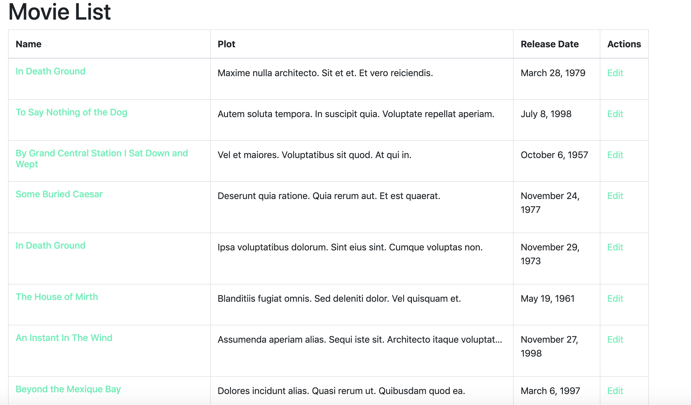

More on this series

<Link to="/posts/rails-api-with-a-frontend-built-in-react-part-i/">Part I</Link>
<Link to="/posts/rails-api-with-a-frontend-built-in-react-part-ii/">Part II</Link>
<Link to="/posts/rails-api-with-a-frontend-built-in-react-part-iii/">Part III</Link>

In this part of the series we will connect the frontend with our API,
recapitulating the previous chapter we allow our API to receive requests from any origin, and that will allow us to run our front in port 3001, while simultaneously run our API in port 3000.

Now let's start creating a folder to store our components.

```bash
$ mkdir src/components
$ mkdir src/components/pages
$ mkdir src/components/partials
```

In order to create our movie visualization, we'll need to add react router to link our components, and avoid re rendering stuff when we don't need to.

```bash
yarn add react-router-dom
```

And we will create a file to declare our routing.

```bash
touch src/AppRouter.js
```

In that file we'll add the following:

```jsx
import React from "react"
import { Route, Switch } from "react-router-dom"
import HomePage from "./components/pages/HomePage"
import MoviePage from "./components/pages/MoviePage"

const AppRouter = () => {
  return (
    <div>
      <Switch>
        <Route exact path="/" component={HomePage} />
        <Route exact path="/movies" component={MoviePage} />
      </Switch>
    </div>
  )
}

export default AppRouter
```

Notice that we're using two components from react-router-dom and we defined our root Route but we don't have one for that yet, so let's do one very quick

```bash
touch src/components/pages/HomePage.js
```

Let's add this to our HomePage:

```jsx
import React from "react"

const HomePage = () => {
  return (
    <div>
      <div className="jumbotron jumbotron-fluid">
        <div className="container">
          <h1 className="display-4">Movie App</h1>
          <p className="lead">This is an App to display and create movies</p>
        </div>
      </div>
    </div>
  )
}

export default HomePage
```

We need to integrate our existing changes with our App.js file, so we'll have to do the following in our `App.js`:

```jsx
// Rest of the imports
import AppRouter from "./AppRouter"

const store = setupStore()

function App() {
  return (
    <Provider store={store}>
      <Router>
        <AppRouter />
      </Router>
    </Provider>
  )
}

export default App
```

Now the code should not compile(because we have not created the MoviePage yet), don't panic and let's create a component that will be in charge of displaying a list of movies.

```bash
$ touch src/components/pages/MoviePage.js
```

This component will be a table containing all the movies available in our database. It will perform a get request to our endpoint to retrieve all the movies available and display them in the table.

We will create the basic structure but first we'll need to add react bootstrap which, to use the JS functionality in bootstrap.

Lets edit our `MoviePage.js` and add a table in that component, we could use the [Table](https://react-bootstrap.github.io/components/table/) component in react-bootstrap but it does not make much sense since we can do it by ourselves.

```jsx
import React, { Component } from "react"

class MoviePage extends Component {
  render() {
    return (
      <div className="container">
        <h1>Movie List</h1>
        <table className="table">
          <thead>
            <tr>
              <th scope="col">Name</th>
              <th scope="col">Plot</th>
              <th>Release Date</th>
              <th scope="col">Actions</th>
            </tr>
          </thead>
          <tbody>
            <tr>
              <th scope="row">Movie 1</th>
              <td>This is the movie description</td>
              <td>This is the relase date</td>
              <td>My action</td>
            </tr>
          </tbody>
        </table>
      </div>
    )
  }
}

export default MoviePage
```

Now if we go to our local server and add in the root url /movies we should see the table we've just created. This is for the moment because we need to create extract that into little components.

We need to add a movie reducer, which will contain an array of movies, and it will add, delete and edit movies. Let's create the file

```bash
touch src/redux/modules/movie.js
```

Lets edit this file, we're recreating our dummy module, it will be the same structure but it will contain more actions.

```js
import { all, put, call, takeLatest } from "redux-saga/effects"
import { handleActions, createAction } from "redux-actions"

// Actions
export const FETCH_MOVIES = "movie-frontend/movie/FETCH_MOVIES"
export const FETCH_MOVIES_SUCCEEDED =
  "movie-frontend/movie/FETCH_MOVIES_SUCCEEDED"
export const FETCH_MOVIES_FAILED = "movie-frontend/movie/FETCH_MOVIES_FAILED"
```

In this extract of our movie module, we have defined 3 modules for fetching the list of movies, if you're familiar to rails, the actions above will be the ones in charge to handle a get request to our API to fetch all the existing movies in our database, we have the first action which will trigger the request and the other ones are for handling the response, which can either succeed or fail.

Now we have to define our initial state, in this case we will have an array of movies, which be default is an empty array, a boolean that will change if the request has finished, and an error variable which is going to display the error if there's one.

```js
// Rest of the code

// Initial State
export const getInitialState = () => {
  return {
    fetching: false,
    movies: [],
    error: null,
  }
}
```

Now we need the reducer, think of the reducer as the way our state should mutate given an action, for example when we perform the `FETCH_MOVIES` action we should mutate our existing movie state, because this action means we're performing a get request so the fetching boolean value should switch to true, the error should keep their null value, and our movie array should be empty as well, because we have not received a response from the server. Is important to keep this in mind, as reducers can be complex the first time.

```js
// Rest of the code

// Reducer

const movieReducer = handleActions(
  {
    [FETCH_MOVIES]: state => {
      return {
        ...state,
        fetching: true,
        error: null,
      }
    },
    [FETCH_MOVIES_SUCCEEDED]: (state, action) => {
      const { data } = action.payload
      return {
        ...state,
        fetching: false,
        movies: data,
      }
    },
    [FETCH_MOVIES_FAILED]: (state, action) => {
      const message = action.payload
      return {
        ...state,
        fetching: false,
        error: message,
      }
    },
  },
  getInitialState()
)

export default movieReducer
```

Notice how the initial state is mutating through the actions, and how defining error and success actions can help us to handle the request in a better way. Let's create the action creators(these will be the ones in charge to dispatch or trigger an action).

```js
// Rest of the code

// Action Creators
export default movieReducer

export const requestMoviesFetch = createAction(FETCH_MOVIES)

export const succeededMoviesFetch = createAction(FETCH_MOVIES_SUCCEEDED)

export const failedMoviesFetch = createAction(FETCH_MOVIES_FAILED)
```

Last but not least we need to use redux-saga to handle the side effects( in this case the get request), redux saga acts as a middleware, so when an action is dispatched, the saga will be triggered as well. We need to define that, and create a generator function to perform that flow.

```js
// Rest of the code
// Sagas
export function* fetchMoviesSaga() {
  try {
    const payload = yield call(fetchMoviesData)
    yield put(succeededMoviesFetch(payload))
  } catch (error) {
    yield put(failedMoviesFetch(error.message))
  }
}

// Main Saga
export function* movieSaga() {
  yield all([takeLatest(FETCH_MOVIES, fetchMoviesSaga)])
}
```

Our fetchMoviesSaga is a generator function that performs the get request and the function is triggered whenever we dispatch the `requestMoviesFetch` action creator, we try to call our api using the [call](https://redux-saga.js.org/docs/api/#callfn-args) effect from redux saga, we're using a function that we have not created yet `fetchMoviesData` and given the result of that call we are going to dispatch in our saga the `succeededMoviesFetch` or the `failedMoviesFetch`. Sounds easy right, then the last function movieSaga is a wrapper of all the sagas for that given resource, we will update it whenever we create a new saga.

We don't have the call yet so let's create it:

```bash
$ touch src/api/movie.js
```

And let's edit the file, remember that on the last post of this series with React, we created a file calle api.js, We 're going to export the axios instance in that file.

```js
import API from "./api"

export const fetchMoviesData = () => {
  return API.get("/movies/")
}
```

Here we're pointing to our rails route movies that should return the whole array of movies. Is not neccesary to use the whole url, because it is already defined in the api.js file. So everything is almost set up, to modify our frontend, but first we are going to add a few things

```js
/* src/redux/modules/movie.js */

// Don't forget to add this import
import { fetchMoviesData } from "../../api/movie"

/* src/redux/modules/rootReducer.js */
import { combineReducers } from "redux"

import dummy from "./modules/dummy"
import movie from "./modules/movie"

const rootReducer = combineReducers({
  dummy,
  movie,
})

export default rootReducer

/* src/redux/modules/rootSaga.js */

import { all } from "redux-saga/effects"
import { dummySaga } from "./modules/dummy"
import { movieSaga } from "./modules/movie"

export default function* rootSaga() {
  yield all([dummySaga(), movieSaga()])
}
```

We just added our new movie to our rootReducer and our new saga to our rootSaga, plus we added the missing import in the movie module.

We have everything set up, now we need to run the rails server in port 3000 and then we can run our React project in the port that you want, but the rails port should be 3000 because that is the one we specified in the axios instance. With that set up let's edit our MoviePage a little bit.

```bash
mkdir src/components/partials/movie
touch src/components/partials/movie/MovieList.js
touch src/components/partials/movie/MovieListItem.js
```

We're trying to make everything smaller so we will break our MoviePage component, it is going to use the ones we just created but first we are going to edit those files.

```jsx
/* MoviePage.js */
import React from "react"
import MovieList from "../partials/movie/MovieList"

const MoviePage = () => (
  <div className="container">
    <h1>Movie List</h1>
    <MovieList />
  </div>
)

export default MoviePage
```

Then we will edit our `MovieList`

```jsx
/* MovieList.js */
import React, { Component } from "react"
import { connect } from "react-redux"
import { bindActionCreators } from "redux"
import { requestMoviesFetch } from "../../../redux/modules/movie"
import MovieListItem from "./MovieListItem"

class MovieList extends Component {
  componentDidMount() {
    const { requestMoviesFetch } = this.props
    requestMoviesFetch()
  }

  render() {
    const { data } = this.props
    const { movies, fetching, error } = data
    return (
      <div>
        {fetching ? (
          <div className="d-flex align-items-center">
            <strong>Loading...</strong>
            <div
              className="spinner-border ml-auto"
              role="status"
              aria-hidden="true"
            />
          </div>
        ) : (
          <table className="table table-hover table-bordered table-responsive-sm">
            <thead>
              <tr>
                <th scope="col">Name</th>
                <th scope="col">Plot</th>
                <th scope="col">Release Date</th>
                <th scope="col">Actions</th>
              </tr>
            </thead>
            <tbody>
              {!!movies && movies.length > 0 ? (
                movies.map(movie => {
                  return <MovieListItem key={movie.id} {...movie} />
                })
              ) : (
                <tr>
                  <th colSpan="4" className="text-center text-danger">
                    {error}
                  </th>
                </tr>
              )}
            </tbody>
          </table>
        )}
      </div>
    )
  }
}

const mapDispatchToProps = dispatch => {
  return bindActionCreators(
    {
      requestMoviesFetch,
    },
    dispatch
  )
}

const mapStateToProps = state => ({
  data: state.movie,
})

export default connect(
  mapStateToProps,
  mapDispatchToProps
)(MovieList)
```

We're passing our state to the component using the mapStateToProps function and we're also passing an action creator (requestMoviesFetch) and we're invoking the method on our componentDidMount method, this is going to make the call to the API and we will be able to see the list of movies, also notice how we are using the fetching and error values that we defined on the initial state, those are useful for displaying something according the request response or even to do something when we're waiting for the response.

Now let's edit our `MovieListItem` component:

```jsx
/* MovieListItem.js */
import React from "react"
import { Link } from "react-router-dom"
import { connect } from "react-redux"
import { prettyDate } from "../../../utils/langHelper"

const MovieListItem = ({ id, title, plot, releaseDate }) => {
  return (
    <tr>
      <td>
        <Link to={`/movies/${id}`}>
          <h6>{title}</h6>
        </Link>
      </td>
      <td>
        <p
          className="d-inline-block text-truncate"
          style={{ maxWidth: "500px" }}
        >
          {plot}
        </p>
      </td>
      <td>
        <p>{releaseDate}</p>
      </td>
      <td>
        <Link to={`/movies/${id}/edit`}>Edit</Link>
      </td>
    </tr>
  )
}

export default MovieListItem
```

This is a dumb component used for displaying the info and that's it, it does not do anything else. If everything was done correctly we should be seeing the list of movies, like this



Cool we did our first API call to our rail app and we're seeing data, now we need to be able to add a movie as well, also see an specific movie and update it. So stay tuned for more.
