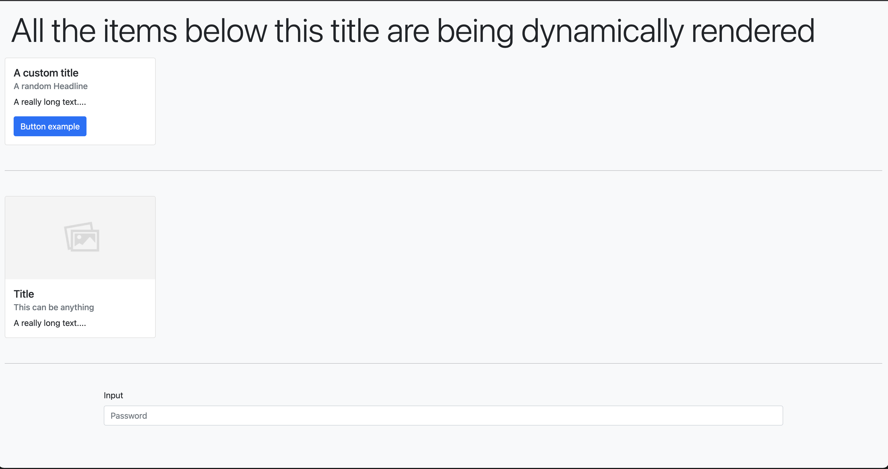

This is my last week in my current job and even though it has been good I think is time to move on. My last two months were pretty amazing because I was working in a project where we wanted to implement dynamic rendering based on a JSON payload.

The JSON has a structure similar to this one:

```json
{
  "type": "Container",
  "data": {
    "id": "4400936b-6158-4943-9dc8-a04c57e1af46",
    "items": [
      {
        "type": "Card",
        "data": {
          "id": "26b3f355-2f65-4aae-b9fd-609779f24fdd",
          "title": "A card example",
          "subtitle": "A subtitle",
          "items": [
            {
              "type": "Button",
              "data": {
                "id": "4400936b-6158-4943-9dc8-a04c57e1af46",
                "title": "Button text",
                "className": "btn-primary",
                "action": {
                  "type": "call",
                  "url": "https://pokeapi.co/api/v2/"
                }
              }
            }
          ]
        }
      },
      {
        "type": "Divider",
        "data": {
          "id": "4400936b-6158-4943-9dc8-a04c57e1af46",
          "marginX": 3
        }
      },
      {
        "type": "Card",
        "data": {
          "id": "4400936b-6158-4943-9dc8-a04c57e1af46",
          "title": "Title",
          "headline": "Month ## - Month ##, ####",
          "copy": "A really long text....",
          "image": {
            "url": "https://i.stack.imgur.com/y9DpT.jpg"
          }
        }
      },
      {
        "type": "Container",
        "data": {
          "id": "d76e3a5f-01ad-46f6-a45d-3ad9699ecf99",
          "fluid": true,
          "embeddedView": {
            "type": "Input",
            "data": {
              "id": "26b3f355-2f65-4aae-b9fd-609779f24fdd",
              "label": "Input",
              "type": "password",
              "placeholder": "Password",
              "isRequired": false,
              "minCharactersAllowed": 1,
              "maxCharactersAllowed": 100,
              "validations": [
                {
                  "regexType": "eightOrMoreCharacters",
                  "regexErrorCopy": "Use 8 or more characters"
                }
              ]
            }
          }
        }
      }
    ]
  }
}
```

Now let’s look closely at the object, we have to create a custom function that checks for the component type that in this case will be the component to be rendered, also if you take a closer look you will notice that some components can have children, some in a prop called items, that is an array of children and some components have an embedded view that is also a child. The rest of the properties included in the data object are the component props and we should pass them as regular props.

With that being said, how we can achieve a dynamic rendering in our react application, The simplest way is to take advantage of the React top-level API method `createElement`. If you know JSX, and how it transpile to regular JS you might heard about this method, basically the function returns a new React element, it works this way:

```js
React.createElement(type, [props], [...children]);
```

- As you can see the first argument is the element type which can be a regular html tag like a div or even a react component or a react fragment.
- The second argument will be the props that we want to use for that component, it can be anything.
- Finally, it also accepts React children, useful if your component is a wrapper component.

I recommend this <Link target="_blank" to="https://reactjs.org/docs/react-without-jsx.html">reading</Link> if you want to learn more how does react transpiles the JSX, it is pretty interesting.

Now we need to read that JSON and call the `React.createElement` every time we encounter a component that is valid, while this can be done with multiple approaches, we decided to use recursion to achieve it. This was written in typescript and the first step to make things work is to define some custom types/interfaces.

```ts:title=dynamic-rendering.interfaces.ts
// Here is a type to map all the components names.
type ComponentList =
    | 'Button'
    | 'Card'
    | 'Container'
    | 'Divider'
    | 'Input';

export interface IComponent {
    type: ComponentList;
    data: {
        id: string;
        embeddedView?: IComponent;
        items?: Array<IComponent>;
        [key: string]: unknown;
    };
}
```

Now that we have the interfaces, we can create a constants file to map the components to an object:

```ts
// dynamic-rendering.constants.ts

// All the component imports

export const Components = {
  Button,
  Card,
  Container,
  Divider,
  Input,
};
```

After that we can create the service that will take the json payload and return the React components in our application.

```ts:title=dynamic-rendering.ts
import React from 'react';
import { IComponent } from './dynamic-rendering.interfaces';
import { Components } from './dynamic-rendering.constants';

export function createPage(data?: IComponent): React.ReactNode {
    // Don't render anything if the payload is falsey.
    if (!data) return null;

    function createComponent(item: IComponent): React.ReactNode {
        const { data, type } = item;
        const { items, embeddedView, id, ...rest } = data;
        return React.createElement(
            // TODO: This can be improved
            Components[type] as any,
            {
                // Pass all the props coming from the data object.
                ...rest,
                id,
                // Make each react key unique
                key: id,
            } as any,
            // Map if there are items, if not try to render the embedded view as children
            Array.isArray(items)
                ? items.map(renderer)
                : renderer(embeddedView ?? null),
        );
    }

    // Don't render anything if the payload is falsey.
    function renderer(
        config: IComponent | null,
    ): React.ReactNode {
        if (!config) return null;

        return createComponent(config);
    }

    return renderer(data);
}
```

This function creates all the components that we receive in the payload and recursively calls the renderer function to create all the children if available.

## Final Thoughts

This is an awesome way to create youw own service, called it cms or whatever you want, to be able to create a payload that your react application can consume and create dynamic content based on it, of course there are some things that still need some thinkering, like UI interaction with buttons or inputs, but of course you can create your custom components that will handle all that functionality and just call them using the payload.

I created a sweet example in <Link target="_blank" to="https://codesandbox.io/s/dynamic-renderer-react-jean182-10zbb">code sandbox</Link> if you want to check the result, also this is the GitHub <Link target="_blank" to="https://github.com/jean182/dynamic-rendering-example-react">repo</Link> if you want to download the code.

Also huge kudos to <Link target="_blank" to="https://github.com/dalvarado98">Daniel</Link> and <Link target="_blank" to="https://github.com/josebedoya">Jose</Link> who helped doing this in the project we are working on.


