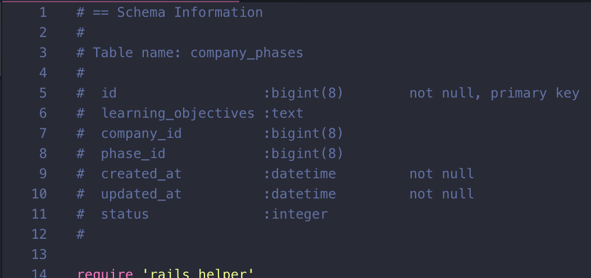
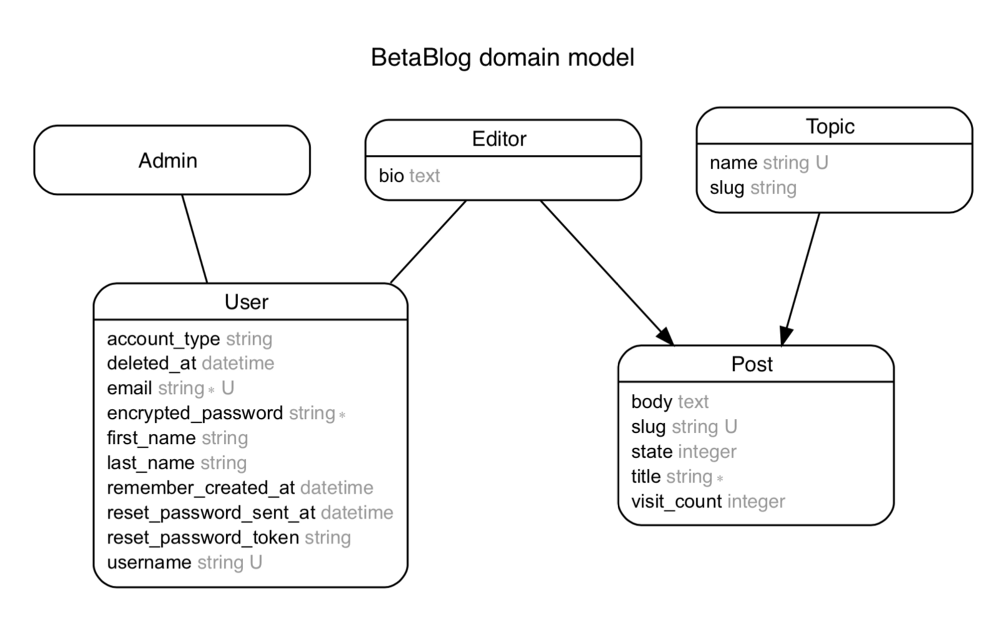
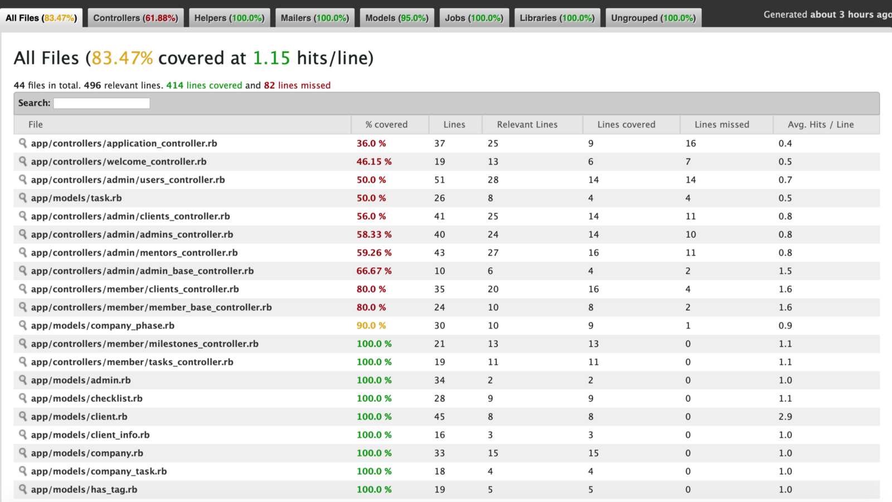

In this post I would like to talk about some gems I consider useful when developing a Rails Project, they make development easier, which is the Ruby philosophy, make the programmer happy and productive.

The first gem it’s called <Link target="_blank" to="https://github.com/plataformatec/devise">devise</Link>. It’s a must have gem for developing a regular app on Rails, it is an authentication app that is composed of 10 modules, which each gives a different functionality and not all of them are required, for example the <Link target="_blank" to="https://www.rubydoc.info/github/plataformatec/devise/master/Devise/Models/Omniauthable">Omniauthable</Link> module is for authenticating using third party providers, so it’s not an essential module which you can choose not to use it.

For me it makes life easier cause when using it, you’re pretty sure you are going to have an authentication logic that is going to be pretty solid and it’s going to reduce your work a lot cause you don’t have the need anymore to build an authentication from scratch.

For API only application devise does not has support out of the box for JWT, so you have to implement that by yourself, or try to use this <Link target="_blank" to="https://github.com/waiting-for-dev/devise-jwt">gem</Link>.

The second gem I would like to talk is one that is called <Link target="_blank" to="https://github.com/ctran/annotate_models">annotate</Link>, the functionality of this gem is to show under your ruby classes a comment summarizing the current schema.

By just using the command $ annotate, you’ll get your models, models specs and factories commented at the beginning with the current schema like this:

As you can see this is very useful because when you’re creating the model logic, sometimes you forget which are the name of the columns that your current model has, so it’s pretty cool to have that feature. When you’re not using this gem what you would normally do is to go under db/schema.rb which is more time consuming than having those comments under the model.

The third gem is called[ rails-erd](https://github.com/voormedia/rails-erd) which generates an entity relationship diagram based on you current models. It’s really useful because sometimes when you have a lot of models, sometimes you get confused on the associations and even though you should have an ERD created before starting to code, having a gem that generates an ERD can help you see if you associated something wrong in the actual program.

The last gem I’m going to mention is [simplecov](https://github.com/colszowka/simplecov) and the main function of it is to check what have you tested under your tests files and what you’re missing, it’s great because sometimes you forget to test some model methods or you forget to test one association and that’s when simplecov comes in handy because everytime you run specs you’ll see new files under coverage folder which contains the hmtl view of the simplecov generated results.

Hope you’ll find this gems useful, I personally think they’re great and the good thing is that the majority of them can be used in any rails project.
